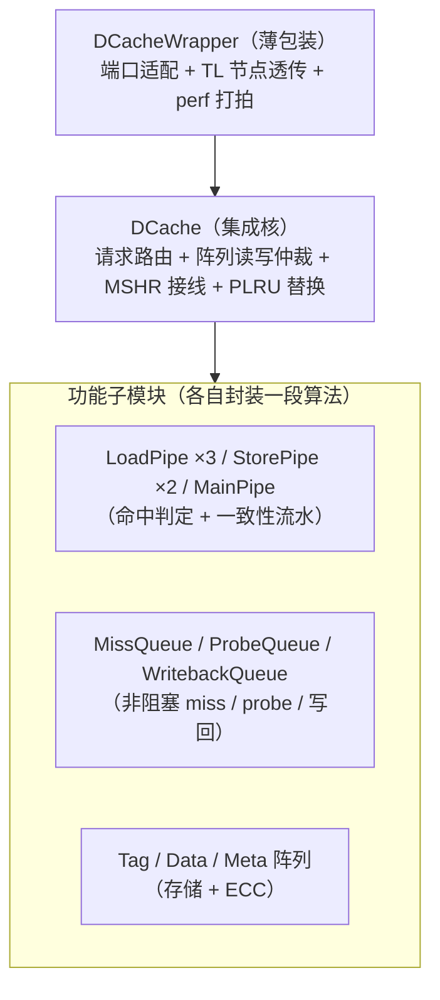
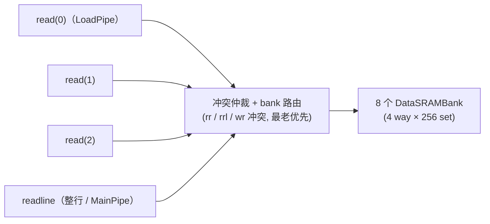
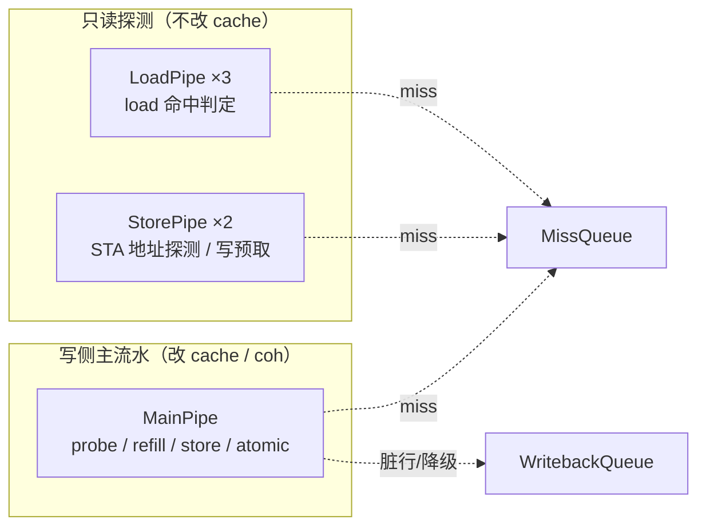
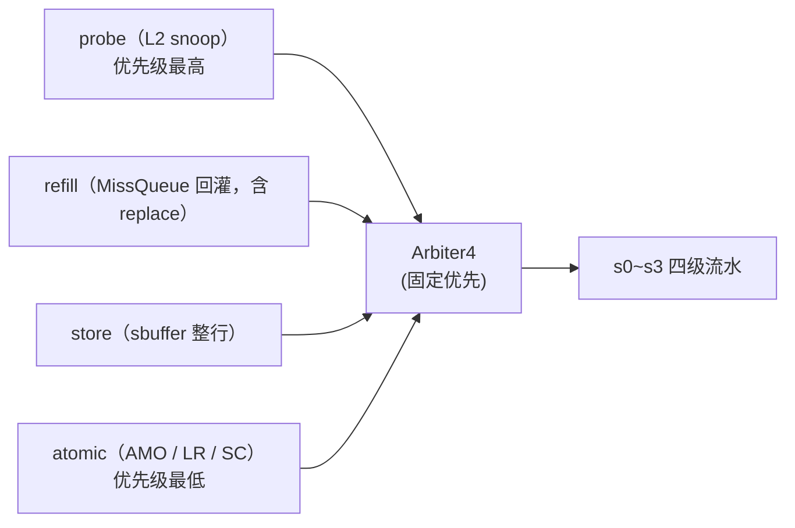
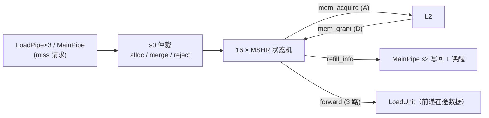
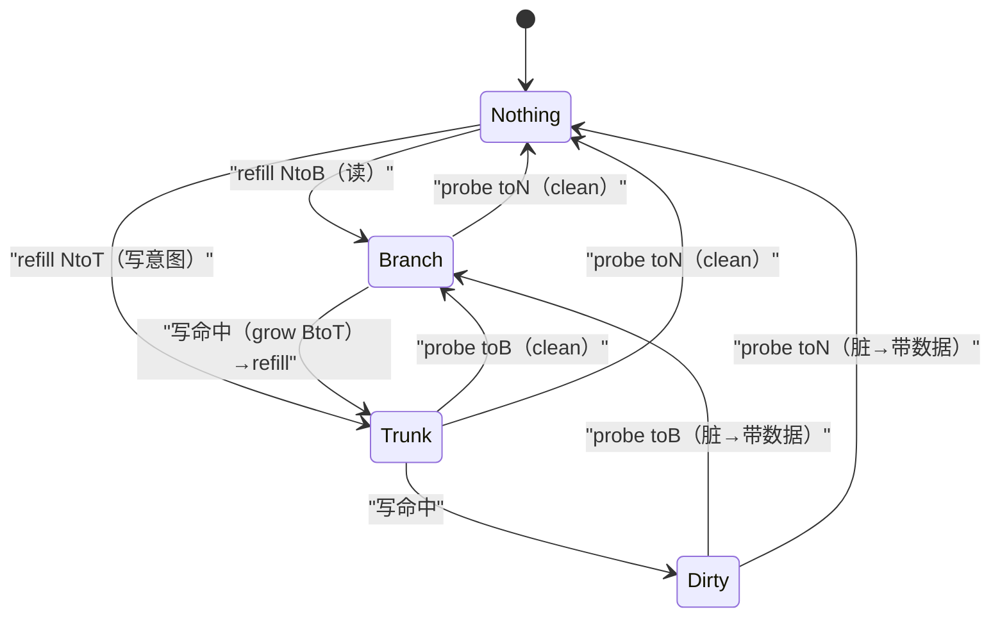
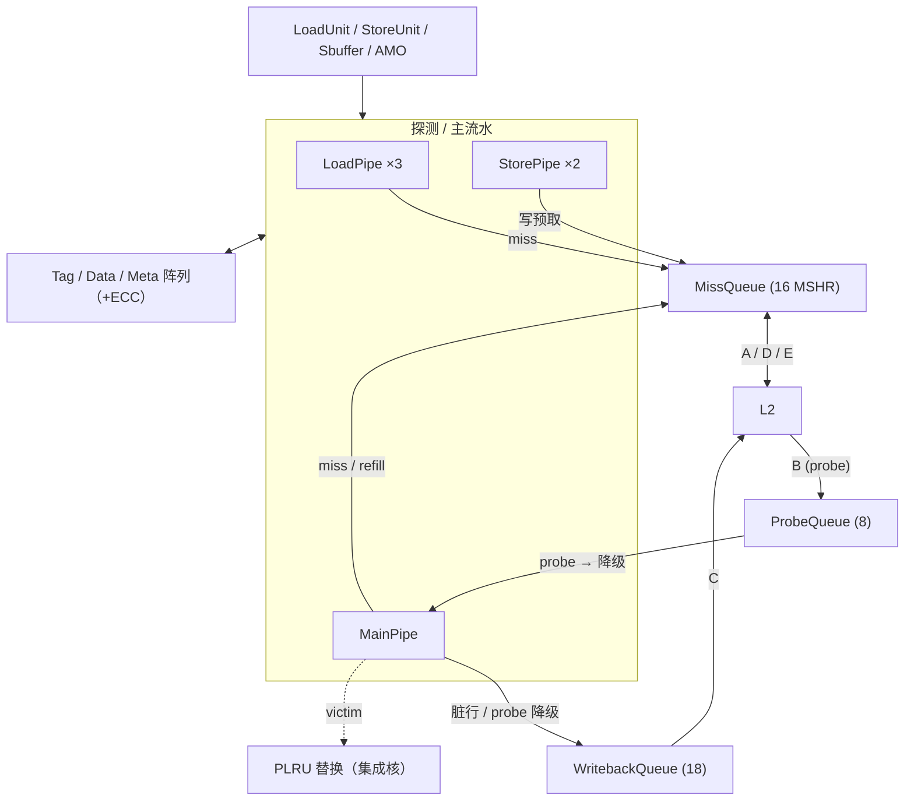

# DCache 原理 —— L1 数据缓存的组织、流水与一致性

> 本文是访存子系统 **DCache** 的背景/原理层：先讲「为什么这么设计」与核心原理，再点到结构如何协同，
> 帮你在读逐模块实现文档前建立整体认知。**不重复端口/实现细节**——具体到位宽、时序、纠错矩阵、
> 验证结论，请转对应模块文档。
>
> 姊妹背景文档：[总览](0-MEMBLOCK_OVERVIEW.md)。
> 本文覆盖的实现文档：[DCacheWrapper](../DCacheWrapper.md) · [DCache](../DCache.md) ·
> [MainPipe](../MainPipe.md) · [LoadPipe](../LoadPipe.md) · [StorePipe](../StorePipe.md) ·
> [MissQueue](../MissQueue.md) · [ProbeQueue](../ProbeQueue.md) · [WritebackQueue](../WritebackQueue.md) ·
> [BankedDataArray](../BankedDataArray.md) · [DuplicatedTagArray](../DuplicatedTagArray.md) ·
> [L1CohMetaArray](../L1CohMetaArray.md) · [L1FlagMetaArray](../L1FlagMetaArray.md)。

---

## 1. DCache 要解决什么问题

L1 DCache 夹在**乱序后端**与 **L2/共享内存**之间，一端要喂饱多条并发的 load/store 流水，另一端要在
多核之间维持一致的内存视图。它的设计压力来自四个相互拉扯的诉求：

1. **高带宽、低延迟**：昆明湖每拍要处理 **3 条 load + 2 条 store 地址**探测，命中路径必须尽量短、
   多口尽量并行。
2. **非阻塞（lockup-free）**：一次 miss 不能卡住后续访问——miss 挂起等 L2 回数据的同时，命中的访问
   要照常穿过流水。
3. **一致性**：多核共享数据，本地缓存的行随时可能被别的核要走（probe），或需要主动写回（release）。
4. **可靠性**：tag/data 存储用 ECC（SECDED）纠检错。

DCache 用一套经典而互相配合的机制回应这些诉求：**组相联 + banked data**（带宽）、**MSHR 非阻塞
miss**（延迟隐藏）、**MESI + TileLink probe/release**（一致性）、**PLRU 替换 + LR/SC 原子**（策略与语义）。
下文逐一展开原理，最后讲这些模块如何在一次访问里协同。

固化参数（KunmingHu V2R2，源自 [`dcache_pkg.sv`](../../../rtl/memblock/dcache_pkg.sv)）：
**4 路组相联 × 256 组**，cacheline 64B 切成 **8 个 bank**（每 bank 8B），
tag 阵列复制 **4 份**，MSHR **16 条**，写回队列 **18 条**，probe 队列 **8 条**。

---

## 2. 分层：Wrapper / 集成核 / 功能子模块

DCache 分三层，越往内越「有算法」：

- **[DCacheWrapper](../DCacheWrapper.md)**：不含 cache 算法，只做端口一一直连、把内层 TileLink client 口
  经 diplomacy `IdentityNode` 透传给 L2、并把 32 路 perf 计数打两拍输出。
- **[DCache](../DCache.md)（集成核）**：把 30+ 个子模块拼成完整 L1。它自己**不做命中判定/流水算法**，只做
  「请求分发到各流水、多读口分配 + 写口仲裁、MSHR 分配接线、A/B/C/D/E 通道路由」，外加**唯一属于集成层
  的算法：PLRU 替换器**。
- **功能子模块**：每个封装一段独立算法，是本文原理的主体。

> 为什么要有「集成核」这一层？因为把 603 个端口、32 个子实例、约 4000 条内部网连起来本身就是巨量机械
> 接线；把它与「有设计意图的算法」（替换器/perf 流水）分开，才能让读者聚焦真正的微架构。

---

## 3. 组相联组织：way / set / bank 与三类阵列

DCache 用 **组相联** 平衡命中率与查找成本：地址的 `vaddr[13:6]` 选 256 组之一（set），组内 4 路（way）
任一都可放这条线。判命中要把访问 tag（`paddr[47:12]`）与该组 4 路存的 tag 逐路比较。

一条 cacheline 的三种信息分开存在**三类阵列**里，各自的实现取舍不同：

| 阵列 | 存什么 | 实现 | 为什么这样 |
|---|---|---|---|
| [DuplicatedTagArray](../DuplicatedTagArray.md) | 每路的物理 tag（+ECC） | SRAM，**整表复制 4 份** | 单口 SRAM 一拍只服务一个读地址，多条流水要**并行查 tag**，故复制 4 份各带独立读口 |
| [BankedDataArray](../BankedDataArray.md) | cacheline 数据（+ECC） | SRAM，**横切 8 个 bank** | 访问不同 bank 的多条 load 可同拍并行读，提升读带宽（灵感自 Sohi/Franklin 高带宽多体存储） |
| [L1CohMetaArray](../L1CohMetaArray.md) / [L1FlagMetaArray](../L1FlagMetaArray.md) | 每行一致性状态（2b）/ 布尔标志（1b，如 error/prefetch） | **寄存器堆**（异步阵列） | 读延迟 1 拍、要多口 + 在途写旁路；量小，用 DFF 比 SRAM 更灵活 |

### 3.1 banked data 的带宽取舍

好处是**多 load 各读各的 bank**互不阻塞；代价是当多口撞同一 bank 体时要仲裁——两条 load 撞同 bank 且
set 不同则冲突，按 load 队列指针（LqPtr 环形比较）选**最老**的放行；load 撞 readline 时 readline 抢占。
128 位 load 会跨两个相邻 bank。细节见 [BankedDataArray](../BankedDataArray.md)。

### 3.2 ECC：可靠性的代价

tag 与 data 都用 **SECDED（单纠错双检错）**：写入时编码校验位，读出时算 syndrome 判错。DuplicatedTagArray
只在写时编码、读出原样透传，**解码判错放在上层**（LoadPipe/MainPipe）做——这样阵列保持纯存储、错误处理
逻辑集中。ECC 是命中路径上的额外代价，故解码结果往往**延后一拍**（`error_delayed`）汇报给 BEU/CSR，不拖慢
数据返回。

### 3.3 meta 阵列的「异步 + 写旁路」

一致性状态/标志用寄存器堆而非 SRAM，是因为它们要 4~5 个读口、且**写有 2 拍延迟**（S0 拆 way → S1 落盘）。
若一条读的 idx 恰好命中在途未落盘的写，直读会拿到旧值，故对每个 (读口, way) 做**在途写转发**。
Coh 与 Flag 阵列同构，唯一差异是非旁路路径寄存的对象（数据 vs idx），详见两篇 meta 文档。

---

## 4. 两条只读探测流水 + 一条写侧主流水

DCache 内有**三种流水**，按「是否改写 cache/一致性状态」分工：

- **[LoadPipe](../LoadPipe.md)**（3 条，只读）：接 LoadUnit 请求，读 tag/meta/data → tag 比对 + 一致性权限
  判定 → 命中回数据、miss 发 MissReq。它**不写 cache**，与 StorePipe 对称。
- **[StorePipe](../StorePipe.md)**（2 条，只读）：跟随 STA（store 地址）流水，探测 store 是否命中；miss 时
  （视配置）发**写预取**（`M_PFW`）把行提前取来。它**不搬 store 数据**——数据走 StoreQueue → Sbuffer →
  DCache。（注：本顶层配置该模块的输出通路被裁剪，实现文档以「未裁剪」完整核为学习载体。）
- **[MainPipe](../MainPipe.md)**（1 条，写侧）：串行处理所有**会改写 cache 或一致性状态**的请求，是 DCache
  的心脏。

### 4.1 为什么 store 数据不走 LoadPipe/StorePipe，而集中到 MainPipe

命中判定可以多口并发只读，但**写 cache 必须串行**——否则同一行的并发写、以及写与 probe/refill 的交织，
会破坏一致性状态机。故所有真正改状态的动作都汇入唯一的 MainPipe，靠一个 4 源仲裁器串行化。

### 4.2 MainPipe 的 4 源仲裁（固定优先级）

优先级 **probe > refill > store > atomic** 的道理：probe 是外部一致性事件，拖延会阻塞别的核；refill 关系
到已在途 miss 的完成，越早落盘越早唤醒等待者；store/atomic 是本核自身进度，可以让路重试。四级流水
s0（仲裁 + 发阵列读）→ s1（tag 比对 + 命中/权限判定 + 选替换 way）→ s2（选数据 + 分流 miss/replay）→
s3（落盘写阵列 + 触发写回 + LR/SC）。分级细节见 [MainPipe](../MainPipe.md)。

---

## 5. 非阻塞 miss：MSHR 与 MissQueue

miss 若阻塞流水，一次 L2 往返（几十~上百拍）就会把带宽打没。**非阻塞 cache**（lockup-free，Kroft 1981）
用 **MSHR（Miss Status Handling Register）** 记录每条在途 miss，让 miss 挂起等数据的同时命中访问继续穿过。

[MissQueue](../MissQueue.md) 是 16 条 MSHR 的集合（MSHR file）：每条 MSHR 是一台状态机，经 TileLink
**A 通道** 向 L2 发 acquire 请求，收 **D 通道** grant 数据后写回 DCache 并唤醒等待者，发 **E 通道**
GrantAck 收尾。

MissQueue 入队时对新 miss 做三选一判定，这是非阻塞的关键：

- **alloc（新分配）**：撞不上任何在途行 → 占一条空 MSHR，发 acquire。
- **merge（合并）**：同一 cacheline 已有在途 miss → **不占新 MSHR**，挂到已有 MSHR 上，省 MSHR、省 L2 带宽。
  规则含内存序约束：load 可合并到 load/store/prefetch，但 **store 不合并到 store**（否则乱同址写序）；且
  要求 **alias 相同**（vaddr[13:12]）。
- **reject（拒绝）**：同 block 但不可 merge（alias 冲突、或 store 撞 store）→ 反压上游重试。

此外 MSHR 支持 **load forward**：load 命中一条正在 refill、数据尚未整行写回的 MSHR，可直接从其已到 beat
前递数据，不必等整行落盘。以及 **BtoT 占用**：把一个 Branch(只读)行升到 Trunk 要同时占一个 way 和一条
MSHR，MissQueue 跟踪每个 set 的 BtoT 在途占用，避免组内 way 被 BtoT 占满死锁。

> 上游流水在真正发 miss 前会先用 `queryMQ` 提前问「这条能否被收下」，把 MissQueue 的判定挪出关键路径，
> 改善时序——这是「延迟隐藏」之外的又一处 timing 考量。

---

## 6. 一致性：MESI on TileLink

多核共享数据，本地缓存的每条行都有一个 **一致性状态**，昆明湖用 4 态（对应 MESI）：

| 状态 | 含义 | 读 | 写 |
|---|---|---|---|
| `Nothing (I)` | 无副本 | 否 | 否 |
| `Branch (S)` | 只读共享 | 是 | 否（需升权） |
| `Trunk (E)` | 独占未脏 | 是 | 是 |
| `Dirty (M)` | 独占已脏 | 是 | 是 |

状态迁移由 **TileLink** 三类事件驱动：本核访问（grow，升权）、L2 探测（probe，降级）、写回（release）。
命中判定的核心是 `onAccess(cmd, coh)`——当前状态是否已满足本次访问，不满足要向 L2 申请的权限增量
（NtoB/NtoT/BtoT）。这些转换在 MainPipe/LoadPipe 里写成对照 rocket-chip `ClientMetadata` 的纯函数。

### 6.1 probe：别的核要数据（B 通道 → 降级）

别的核要写一条本地缓存着的行时，L2 从 **B 通道** 发 probe。[ProbeQueue](../ProbeQueue.md) 收下（8 个 entry），
把 probe 送 MainPipe 执行降级。两个原理性细节：

- **vaddr 重建（别名）**：L2 用 paddr probe，但 DCache 的 index 含高于 tag offset 的虚地址位（别名），
  故 probe 报文里藏几位别名位，ProbeQueue 要拼回完整 index 才能找到行。
- **与 LR/SC 让路**：probe 撞上正被 LR/SC 保留的块时，要延一拍让路（见 §8）。

### 6.2 release：主动/被动把行交出去（C 通道 → 写回）

[WritebackQueue](../WritebackQueue.md)（18 个 entry）经 **C 通道** 把行交给 L2，分两种：

- **自愿写回（voluntary Release）**：容量替换逐出一条脏行，主动 Release/ReleaseData，**要等 L2 回
  ReleaseAck（D 通道）** 才算完成。
- **被动 probe 应答（ProbeAck）**：probe 降级后回 ProbeAck/ProbeAckData，**不需要**等 ack。

关键区分：**「是否带数据」由行脏不脏决定，不等于 coh 迁移方向**——脏行降级恒带数据（opcode 用
ReleaseData/ProbeAckData=7/5），clean 行只在 probe 明确要数据时才带（否则用无数据的 Release/ProbeAck=6/4）。
写错会让 opcode 误升级。18 条 entry 汇聚到单一 C 通道用 **TileLink robin（轮转优先 + 多 beat 锁定）** 仲裁：
一次写回是多个 beat 的突发，突发期间授权锁定给同一 entry。

### 6.3 refill / grant（D 通道 → 回灌）

D 通道回来的数据按 opcode 分流：grant 数据交 MissQueue 完成 refill、经 MainPipe 写回 cache；ReleaseAck 交
WritebackQueue 释放对应写回 entry。

---

## 7. 替换：Tree-PLRU

miss 要装新行、组内 4 路都占用时，得挑一路替换。DCache 用 **Tree-PLRU（伪最近最少使用）**——每组一棵
4 路二叉树，用 3 bit 近似记录「哪半/哪路更该替换」，比真 LRU 省状态。这是**集成核 DCache 自己实现的
唯一算法**（其余算法都在子模块内）。

- **查 victim**：先看 `state[2]` 哪半更老，再看该半内哪路更老，两位拼成 victim way。
- **touch 更新**：访问某 way 后翻转指向它的树节点位，把它标记为「最近使用」。一拍内多个 touch 端口
  （ldu×3 + mainPipe）可能撞同组，按端口序折叠（后者优先）。

实现要点、异步复位与 way 编码方向等易错点见 [DCache §3](../DCache.md)。（注：本子系统另有公共替换器库
[PlruReplacer](../../common/PlruReplacer.md) 可对照。）

---

## 8. LR/SC 原子与 backoff

RISC-V 的 **LR/SC**（Load-Reserved / Store-Conditional）要求：LR 建立对某块的「保留」，其后若无人破坏保留，
SC 才成功。DCache 在 MainPipe s3 维护这个保留锁：

- **保留计数 `lrsc_count`**（6 位）：LR 命中且可做原子时置 `LRSC_CYCLES-1`（=63），存下块地址；每拍自减；
  外部 `invalid_resv_set`（别的核抢锁 / probe 命中）清 0。
- **backoff 窗口**：保留**只在 `lrsc_count > LRSC_BACKOFF`（=3）时才有效**——尾部 3 拍刻意判失效。这是
  **活锁避免**：两核互相打断对方保留时，尾窗让 SC 必然失败一次，打破对称重试的死循环。
- **SC 成败**：SC 要求保留仍有效、地址匹配且命中，否则失败（不写、回失败码）。

保留信息还对外广播（`lrsc_locked_block`）供 load/store 与 probe 做冲突让路——这正是 §6.1 里 probe 要给
LR/SC 让路的来源。AMO（原子读改写）走 MainPipe 的 atomic 源，命中后用内部 AMOALU 在 s3 计算并落盘。

---

## 9. 一次访问如何穿过这些模块（把原理串起来）

**load 命中**（最快路径）：
LoadUnit → LoadPipe s0 读 tag/meta/data（tag 阵列 4 副本之一 + data 多 bank 并行）→ s1 tag 比对 + 权限判定
→ s2 命中，128b 数据回 LoadUnit → s3 ECC 延迟汇报 + 回写 access 标志 + 更新 PLRU。全程不碰 MainPipe。

**load 未命中**：
LoadPipe s2 判 miss → 发 MissReq 给 MissQueue → alloc 一条 MSHR，A 通道 acquire → L2 → D 通道 grant → MSHR
拿到数据（其间同址后续 load 可 merge 或 forward）→ 经 MainPipe refill 源写回 data/meta/tag 阵列、更新 coh、
唤醒等待的 load。若组满需替换，PLRU 选 victim，脏 victim 交 WritebackQueue 经 C 通道写回 L2。

**store**：
STA 地址经 StorePipe 探测（命中/写预取）；store 数据经 StoreQueue → Sbuffer 攒成整行 → 从 MainPipe 的 store
源进主流水，s1 判权限（须 Trunk/Dirty，否则 miss 走 §5 补块或 BtoT 升权），s3 逐字节合并写 data 阵列、
coh 升到 Dirty。

**probe（外来一致性）**：
L2 B 通道 → ProbeQueue（重建 vaddr、给 LR/SC 让路）→ MainPipe probe 源（最高优先）→ s3 降级 coh，若脏则经
WritebackQueue C 通道回 ProbeAckData，否则回无数据 ProbeAck。

---

## 10. 小结与阅读顺序

DCache 的设计可归纳为一句话：**用组相联 + banked/复制阵列换带宽，用 MSHR 换 miss 延迟隐藏，用
MESI+TileLink probe/release 换多核一致性，用 PLRU/LR-SC 定策略与语义，全部靠一条串行 MainPipe 收敛写侧
状态变更**。

建议阅读顺序：
1. 先 [DCacheWrapper](../DCacheWrapper.md) → [DCache](../DCache.md)：看清分层与集成核职责（+PLRU）。
2. 再三条流水 [LoadPipe](../LoadPipe.md) / [StorePipe](../StorePipe.md) / [MainPipe](../MainPipe.md)：命中判定
   与一致性状态机。
3. 然后非阻塞与一致性外围 [MissQueue](../MissQueue.md) / [ProbeQueue](../ProbeQueue.md) /
   [WritebackQueue](../WritebackQueue.md)。
4. 最后存储层 [BankedDataArray](../BankedDataArray.md) / [DuplicatedTagArray](../DuplicatedTagArray.md) /
   [L1CohMetaArray](../L1CohMetaArray.md) / [L1FlagMetaArray](../L1FlagMetaArray.md)。
