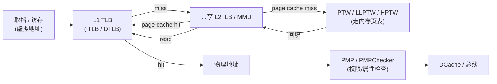
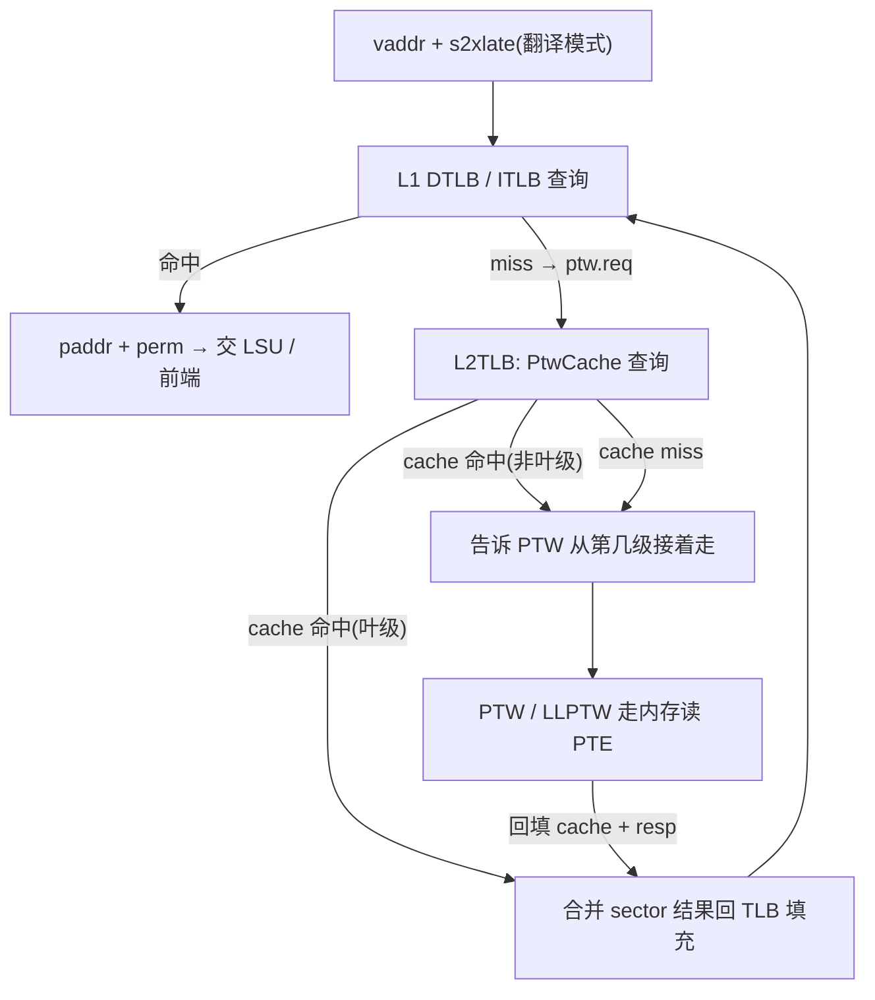
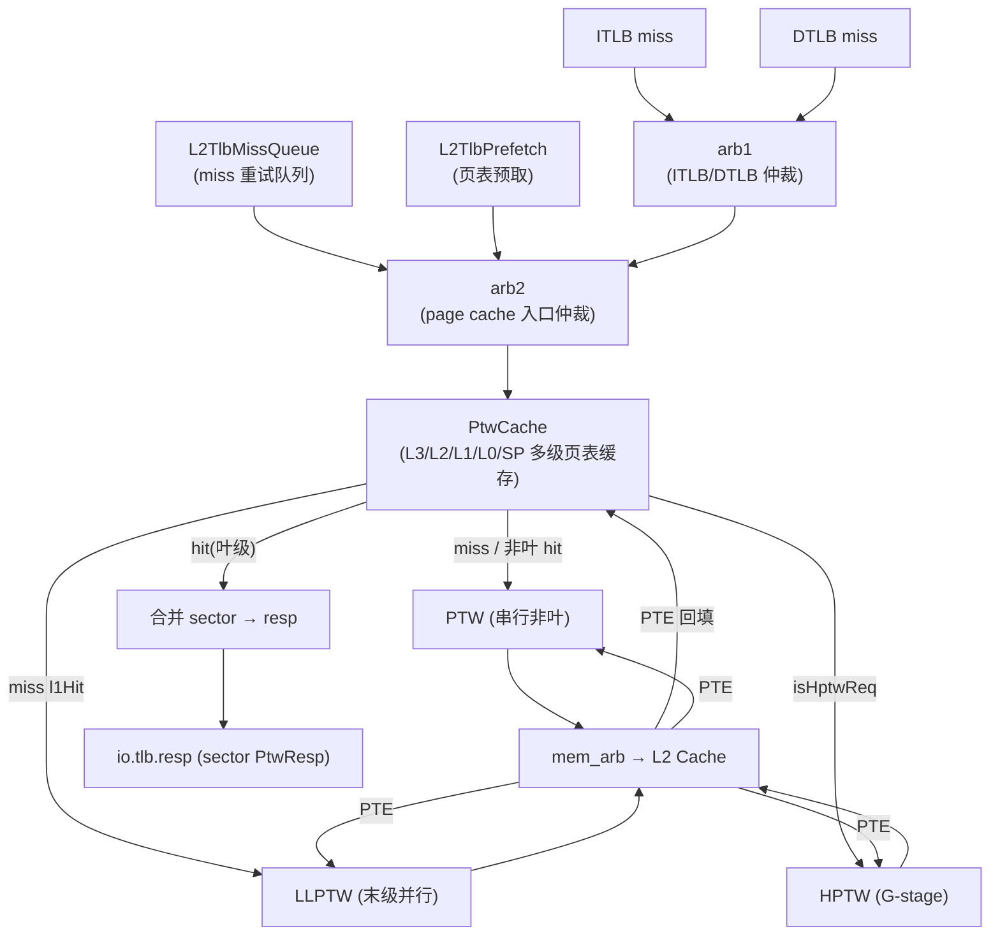
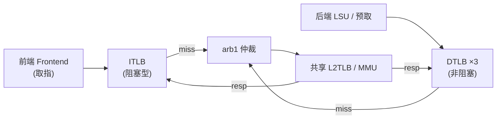
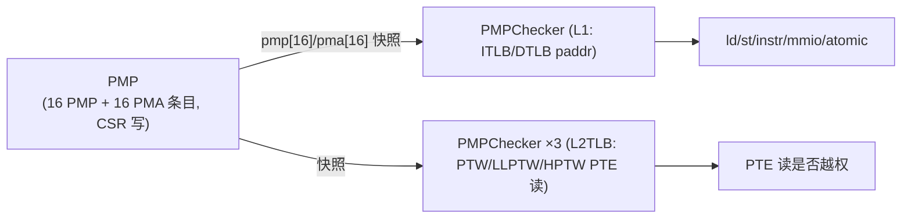

# 地址翻译原理：TLB / MMU / PTW

> 本文是访存子系统 **地址翻译（虚→实）** 的背景/原理篇：先讲“为什么要这样分层、每一步在解决什么问题”，
> 再点到各模块如何协同；**不重复**逐模块端口/实现细节——那些请看各模块设计文档。
> 姊妹背景篇见 [`0-MEMBLOCK_OVERVIEW.md`](0-MEMBLOCK_OVERVIEW.md)；实现权威仍以模块文档与 RTL 为准。

---

## 1. 为什么需要这一整套机构

香山的取指（前端 ITLB）和访存（后端 load/store/预取）拿到的都是**虚拟地址**，而 DCache / 总线 / 内存
只认**物理地址**。中间必须有一次“虚→实”翻译，翻译规则由页表（在内存里的多级树）描述。直接每次访问都去
内存查页表太慢，于是引入**多级缓存 + 遍历器**：

- **L1 TLB**（每个访问口一个）：缓存最近用过的翻译结果，命中即 1~2 拍出物理地址；
- **L2TLB / MMU**（**核内共享**，即本核各 L1 TLB 的公共后端；每个核有自己的 L2TLB，非跨核）：L1 miss 的公共后端，内含**页表 cache（PtwCache）**与三个**页表遍历器**；
- **PTW / LLPTW / HPTW**：真正去内存（经 L2 cache）逐级读页表项的“走表”硬件；
- **PMP / PMPChecker**：翻出物理地址后的**物理内存权限/属性关卡**，与翻译并行把关。

一句话概括这条链：**先查 L1 TLB → 未命中问共享 L2TLB → 页表 cache 也未命中就派遣遍历器走表 → 回填各级
cache 与 TLB；每一步翻出的物理地址都要过 PMP。**

本工程的关键前提配置（取自 golden RTL 实测，见 [`../L2TLB.md`](../L2TLB.md)）：
`EnableSv48=true`（**四级**页表 + 超级页 SP）、`HasHExtension=true`（支持 hypervisor 两阶段翻译）、
`HasBitmapCheck=false`（无 bitmap 通路）、`enablePrefetch=true`、`tlbcontiguous=8`（sector TLB，见下）。

---

## 2. 虚实翻译的总流程

单阶段（无虚拟化）翻译就是沿页表树从根走到叶：Sv48 用四级、每级 9-bit VPN 段索引一张页表，
命中叶子（leaf PTE）得到最终物理页号 PPN，中途可能命中**超级页**（1GB/2MB/512GB 或 svnapot 64KB）而提前结束。

从硬件视角，这条流程被拆成三层，各层的“未命中”把工作往下一层推：

要点：
- **L1 miss 不阻塞后续访问**（数据侧 DTLB 是非阻塞的，见 §3）：miss 请求发往 L2TLB，本条指令由 LSU 重放；
- **L2TLB 是“查得到就返回，查不到就告诉 walker 从哪一级接着走”**：PtwCache 缓存了页表树的每一级，
  命中越靠近叶子，遍历器要补走的级数越少（见 §5）；
- 翻译结果以 **sector（8 个连续 4KB 子页）** 为粒度回填 TLB，一次走表能填一整片，提升利用率。

---

## 3. L1 TLB：贴着访问口的第一级缓存

每个取指/访存口都有一个 L1 TLB。它由三块协同：**顶层控制（TLBNonBlock）+ 存储与替换（TlbStorageWrapper）
+ 全相联条目阵列（TLBFA）**。

### 3.1 非阻塞数据 TLB —— [TLBNonBlock](../TLBNonBlock.md)

数据侧（load/store/prefetch）用**非阻塞** TLB，三者端口数不同：load DTLB 4 路、store/prefetch DTLB 各 2 路（本篇多以 load 的 `Width=4` 为例）：

- **两拍流水**：s0 收请求、算翻译模式 `s2xlate` 与预检异常、把 vpn 送存储读口；s1 合成命中/物理地址/权限，
  miss 时向 PTW 发请求。`req.ready` 恒 1——**miss 不扣住后续请求**，而是直接回一个 `miss=1`，由下游 LSU 自行重放。
- 这与取指侧的**阻塞型** ITLB 相反：ITLB 会扣住请求等 PTW 回来（`handle_block`）。选择非阻塞是因为访存流水
  要保持吞吐，让乱序的 LSU 去承担重放。
- 顶层还处理两个易错的“时序缝隙”：**PTW 回填旁路**（回填那拍存储还没写进去，用旁路直接命中该 vpn）和
  **need_gpa 状态机**（命中项触发 guest page fault 时需再向 PTW 要一次 GPA）。

### 3.2 存储 + 替换 —— [TlbStorageWrapper](../TlbStorageWrapper.md) + [TLBFA](../TLBFA.md)

TLB 顶层本身不存页表项。存储在内层：

- **[TLBFA](../TLBFA.md)** 是**全相联**条目阵列（本配置 `nWays=48`），用 CAM 并行匹配。它的关键设计是
  **sector TLB**：一条条目的一个 tag 覆盖 `tlbcontiguous=8` 个连续 4KB 子页，每个子页有独立的
  `valididx / pteidx / ppn_low`。好处是**一次 PTW 回填一整个 sector**；命中时用 `vpn[2:0]` 选具体子页。
  条目还带 `level`（4KB/2MB/1GB）与 `n`（64KB napot），支持大页的分级 tag 匹配。
- **[TlbStorageWrapper](../TlbStorageWrapper.md)** 几乎是“透明路由”：把查询/回填/sfence/csr 一字段直连内层 TLBFA，
  **它唯一自有的有状态逻辑是替换器**——一棵 **Tree-PLRU**（48 路用 47 个状态位的伪 LRU 二叉树），
  根据 TLBFA 反馈的命中/刚回填 way 更新，组合算出下次回填的 victim way。

> ITLB 与 DTLB 结构同源（都是 TLBFA + PLRU），仅端口数与阻塞策略不同；三个数据 DTLB（load/store/prefetch）
> 各自例化一份，但 miss 后都汇到**同一个** L2TLB（见 §7）。

---

## 4. PTW：串行走上层页表 —— [PTW](../PTW.md)

L2TLB 的 page cache 未命中时，请求进入**页表遍历器**。[PTW](../PTW.md) 是**串行**遍历器（一次只在飞一条），
负责走**上层（非叶级）**页表：它按当前 level 用 `{ppn, VPN段, 3'b0}` 算出 PTE 地址，经 PMP 检查后向 L2 cache
发访存读 PTE，读回后解析：

- 遇到 **leaf / superpage / page fault / access fault / guest fault** → 直接返回；
- 走到**最后一级仍是 non-leaf** → 把请求交给并行的 **LLPTW**（末级遍历）；
- 需要 **G-stage** 翻译（hypervisor）时把地址交给 **HPTW**（见 §6）。

PTW 内部用 Scala 遗留的 `s_* / w_*` 位级握手协议表达状态机（`sent_*`/`wait_*`），
PTE 的解析（reserved / PBMT / 非法 `W&&!R` / NAPOT / superpage 对齐等 page-fault 判据）由 `pte_page_fault()`
等纯函数实现。

---

## 5. L2TLB：核内共享的二级 MMU —— [L2TLB](../L2TLB.md)

[L2TLB](../L2TLB.md) 是所有 L1 TLB（ITLB / DTLB）的**共享后端**。它本身只做**仲裁 / 路由 / 分发 / 访存数据通路的
glue**，把遍历、缓存、预取、检查都委托给子模块。核心是三个协作件：**PtwCache（页表 cache）+ 三个遍历器 +
miss 队列 / 预取器**。

### 5.1 [PtwCache](../PtwCache.md)：为什么分五级

页表是一棵四级树；PtwCache 给**每一级非叶节点**都开一块缓存，外加叶子（L0）与超级页（SP），共五个阵列：
**L3 / L2 / L1 / L0 / SP**。设计取舍：

- **L3/L2/SP 小且全相联**（各 16 项）：根附近的非叶节点很少、复用率极高，全相联命中率最好；
- **L1/L0 大且组相联用 SRAM**（L1 8set×2way=16 项，L0 32set×4way=128 项）：靠近叶子的项数量巨大，
  必须用 SRAM 省面积，用 set-PLRU 替换；
- **L1/L0 一行存 8 个连续 PTE（sector）**：一次 refill 带回一整条 64B cacheline = 8 个 PTE，正好填满一行。

命中越深（越靠 L0），遍历器要补的级数越少：**L0/SP 命中 = cache 直接给最终翻译**；**L3/L2/L1 命中 = 告诉 PTW
“从第几级、哪个 ppn 接着走”**（`toFsm`）。PtwCache 用一条**三级流水**（读 SRAM → tag 比较/ecc → 出结果）
把单口 SRAM 的读延迟错开，是本模块最易错的相位所在。

### 5.2 [LLPTW](../LLPTW.md)：末级并行遍历

与串行的 PTW 互补，[LLPTW](../LLPTW.md) 维护一个 `llptwsize=6` 的**条目池**，让多个“最后一级 4KB”请求
**并发遍历**但**共享一个访存口**。它最核心也最易错的逻辑是**访存去重**：同一条 L0 cacheline
（`vpn[37:3]` 相同）里的多个 4KB 请求只发一次访存，其余条目共享同一笔响应。

### 5.3 [L2TlbMissQueue](../L2TlbMissQueue.md)：page cache miss 的延迟槽

本质是一个**深度 `MissQueueSize=40`、带 flush 的 FIFO**（[L2TlbMissQueue](../L2TlbMissQueue.md)）：
在 page cache 里“页目录项（pde）miss”的请求需要重访 page cache，队列给它们排队缓冲；若 pde 命中则不进队列、
直接走 LLPTW。flush（sfence / satp / vsatp / hgatp 变更）一拍清空。L2TLB 顶层还有 `tlb_counter` 节流
（在途请求 < 40 才放行 arb1），防止该队列溢出。

### 5.4 [L2TlbPrefetch](../L2TlbPrefetch.md)：下一行页表预取

一个极简的“下一行”预取器（[L2TlbPrefetch](../L2TlbPrefetch.md)）：每见到一个被访问的 VPN，就推测下一条
cacheline 的页表项也会很快用到，生成指向 `next_line` 的预取请求注入 L2TLB 仲裁，提前把页表项拉进 page cache。
带一个 4 条深度的去重窗口避免重复预取。

---

## 6. Hypervisor 两阶段翻译 —— [HPTW](../HPTW.md) + [LLPTW](../LLPTW.md)

开启 H 扩展（`HasHExtension=true`）后，虚拟机里的一次翻译是**两阶段**的：
**VS-stage**（用 vsatp）把 guest 虚拟地址译成 **guest 物理地址 GPA**，再由 **G-stage**（用 hgatp）把 GPA
译成 **host 物理地址 HPA**。而且 VS-stage 走表时读的每一个页表项地址本身也是 GPA，也要经 G-stage 落到真实内存。

- **[HPTW](../HPTW.md)** 是专用的 **G-stage 遍历器**：接收一个 gvpn，用 `hgatp` 作根**自己走完所有级**
  （不像 PTW 把末级交出去），返回 `HptwResp`。它与 PTW 的关键差异在权限——G-stage 是 LOAD 型访问，
  叶子必须 `U=1 && A=1`，其 page-fault 判据 `isGpf` 不能照抄 `isPf`；根级用 x4 的 11-bit 索引
  `MakeGPAddr(hgatp.ppn, gvpnn)`。
- **翻译模式 `s2xlate`** 贯穿全链（`NO_S2XLATE / ONLY_STAGE1 / ONLY_STAGE2 / ALL_STAGE`），
  由 virt 与 vsatp/hgatp.mode 决定，TLB、PtwCache、PTW、LLPTW、HPTW 都按它选择比较/走表路径。
- **谁来调 HPTW**：PTW 在走非叶级需要把页表页 GPA 落地时调 HPTW；[LLPTW](../LLPTW.md) 在 `allStage`
  请求里需要**两次** HPTW——首次把页表页 GPA 译成 HPA，末次把 VS-stage leaf 的 GPA 译成最终 HPA entry。
  L2TLB 顶层用 `hptw_req_arb / hptw_resp_arb` 把两路请求汇到唯一的 HPTW 并按 id 分发响应。

---

## 7. 前端 ITLB 与访存如何共享 L2TLB

前端有自己的 ITLB（取指 TLB），但**它没有独立的页表遍历后端**——ITLB miss 后同样回到访存子系统里的这个
共享 L2TLB 走页表。L2TLB 顶层的第一级仲裁 `arb1` 就是在 **ITLB 与 DTLB 的 miss 请求间选择**
（本配置请求 `source` 仅 2 bit：ITLB=0 / DTLB=1），选中后统一进 PtwCache 查询、必要时派遣遍历器。

这样设计的好处是**页表 cache 与遍历器只做一份**、取指与访存共享命中与预取收益；代价是取指与访存会在 L2TLB
入口竞争，故有 `arb1` 仲裁 + `tlb_counter` 节流来协调。前端 ITLB 的存储/替换与 DTLB 同源
（同样是 [TLBFA](../TLBFA.md) + [TlbStorageWrapper](../TlbStorageWrapper.md)，只是端口数不同）。

---

## 8. PMP / PMPChecker：物理内存的权限关卡

翻译得到物理地址还不够——RISC-V 还有一道与页表无关的**物理内存保护**。它分两个模块：

- **[PMP](../PMP.md)** 只负责**存与写**架构状态：16 条 PMP（保护：读/写/执行）+ 16 条 PMA（属性：可缓存/原子/MMIO）
  条目寄存器，响应 CSR 写，把最新条目**快照广播**给各处 PMPChecker。本配置 `PlatformGrain=12`（4KB 粒度）导致
  `CoarserGrain=true`：NA4 不可用、掩码至少覆盖一个页。
- **[PMPChecker](../PMPChecker.md)** 做真正的**逐地址判定**：对一个物理地址 + 命令 + 特权 mode，逐条目做
  NAPOT 掩码 / TOR 区间匹配，**低序号优先**选中命中条目，按命令算出 `ld/st/instr`（access fault）与
  `mmio/atomic`（属性）。M 模式对未锁定条目默认放行（`ignore`）。

PMP/PMPChecker 在两处出现：一是 **L1 侧**——ITLB/DTLB 翻出物理地址后过 PMPChecker（MemBlock 里例化多个）；
二是 **L2TLB 内部**——PTW/LLPTW/HPTW 每次向内存发 PTE 读之前，都先用各自的 PMPChecker（mode=S、cmd=read）
检查那笔访存地址是否越权。也就是说，**走页表本身也要受 PMP 约束**。

---

## 9. sfence / hfence：什么时候要作废翻译

页表被软件改动后，缓存的翻译会失效，需要 `sfence.vma` / `hfence.vvma` / `hfence.gvma` 逐层作废：
**L1 TLBFA 按 vpn/asid/vmid 清 valid**、**PtwCache 各阵列按折叠比较量清 valid**、
**L2TlbMissQueue/Prefetch 直接 flush 清空在途**。satp/vsatp/hgatp 变更也触发 L2TLB 的 flush。
各层的四象限（rs1 指定 va × rs2 指定 asid）与两阶段（hv/hg）刷除语义在各模块文档有详表——本篇只强调：
**翻译链的每一级缓存都必须响应同一次 fence**，这是正确性的底线。

---

## 10. 小结：模块与角色对照

| 层 | 模块 | 角色 |
|----|------|------|
| L1 控制 | [TLBNonBlock](../TLBNonBlock.md) | 数据 DTLB 顶层（非阻塞，两拍） |
| L1 存储 | [TLBFA](../TLBFA.md) / [TlbStorageWrapper](../TlbStorageWrapper.md) | 全相联 sector 条目 + Tree-PLRU 替换 |
| L2 顶层 | [L2TLB](../L2TLB.md) | 共享 MMU：仲裁/路由/访存 glue |
| L2 缓存 | [PtwCache](../PtwCache.md) | L3/L2/L1/L0/SP 五级页表 cache |
| 遍历 | [PTW](../PTW.md) / [LLPTW](../LLPTW.md) / [HPTW](../HPTW.md) | 串行非叶 / 末级并行 / G-stage |
| 辅助 | [L2TlbMissQueue](../L2TlbMissQueue.md) / [L2TlbPrefetch](../L2TlbPrefetch.md) | miss 重试队列 / 页表预取 |
| 权限 | [PMP](../PMP.md) / [PMPChecker](../PMPChecker.md) | 物理内存保护/属性快照 + 逐地址判定 |
| 时序 | [TLBuffer](../TLBuffer.md) | TileLink A/D 通道缓冲，切 ready 长路径 |

> RTL 在 [`../../../rtl/memblock/`](../../../rtl/memblock/)（如 `L2TLB.sv` / `PtwCache.sv` / `PTW.sv` /
> `TLBFA.sv` / `PMP.sv` 等）；本篇涉及的具体数值/结构均以各模块文档与对应 `.sv` 为准。
