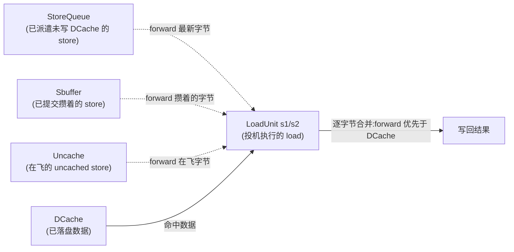
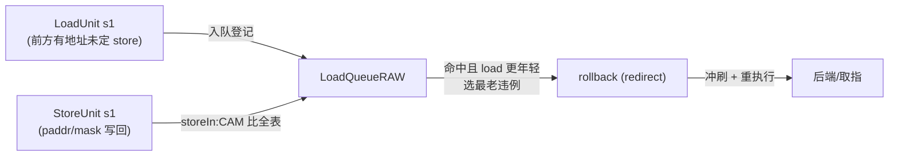
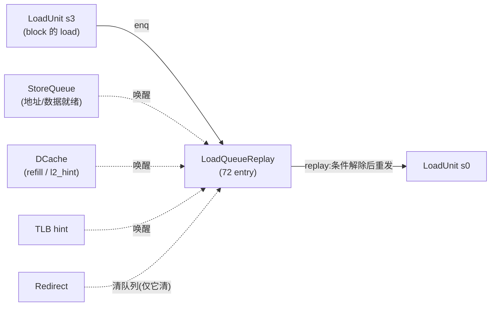
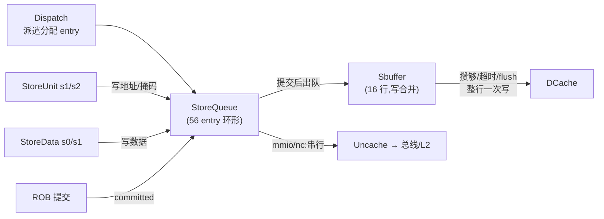
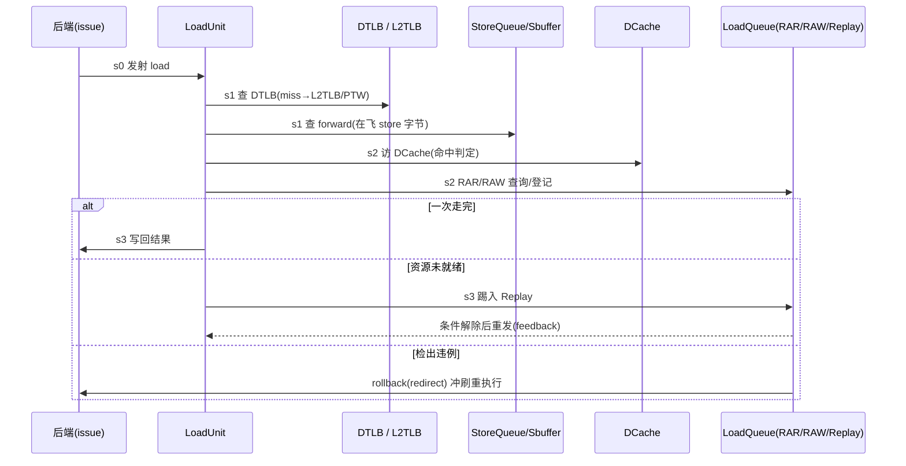

# 内存序、一致性与控制流时序

> 本文是访存子系统的**背景/原理层**文档：讲清「乱序访存为什么还能保证正确的内存序、
> 违例怎么检测与回滚、写为什么要攒、控制流时序如何串起来」这些**动机与机制**,让你在
> 读逐模块设计文档前先建立整体认知。它**不重复**各模块的端口/实现细节——那些在
> `../<Module>.md` 里。总览见 [`0-MEMBLOCK_OVERVIEW.md`](0-MEMBLOCK_OVERVIEW.md)。

---

## 0. 一句话主线

昆明湖是**乱序核**:load/store 在流水线里**乱序执行**(谁的操作数/地址/数据先就绪谁先做),
但对软件和其它核而言,它们必须**表现得像按程序序执行**。这个「乱序执行、按序可见」的假象,
就是访存子系统一大半复杂度的来源——本文讲的就是它靠哪些结构、哪些回路来维持。

RISC-V 的内存模型是 **RVWMO(RISC-V Weak Memory Ordering)**:同一 hart 内,对**同一地址**的
访存必须保持程序序观感,不同地址之间默认可重排(除非有 fence/acquire-release 约束)。所以硬件
真正要盯死的是三类「同地址乱序」隐患:

| 隐患 | 谁读到了不该读的值 | 检测结构 |
|------|---------------------|----------|
| **RAW**(store→load) | 年轻 load 越过了地址未定的老 store,漏掉了本该 forward 的字节 | [LoadQueueRAW](../LoadQueueRAW.md) |
| **RAR**(load→load,跨核) | 两条同地址 load 之间别的核改了这行,乱序执行让本核观察到非法写序 | [LoadQueueRAR](../LoadQueueRAR.md) |
| **同 hart forward 正确性** | load 该读到在飞 store 的最新字节,却读了 DCache 里的旧值 | StoreQueue/Sbuffer forward |

前两类靠**事后检测 + 回滚重执行**兜底(投机执行、错了再纠);第三类靠**前递(forward)**在执行当拍就把
在飞 store 的数据补给 load。下面逐一展开。

---

## 1. 为什么可以乱序执行:投机 + forward + 回滚

顺序核里 load 要等前面所有 store 都写完内存才能读,吞吐极低。昆明湖的做法是**放开执行、事后纠错**:

- load 只要地址翻译好、DCache 有数据,就**立刻投机执行**并把结果写回,不等前面的 store。
- 为了不读到过期数据,load 在执行途中同时向**所有在飞 store**(StoreQueue)和**写合并缓冲**
  (Sbuffer)、**非缓存缓冲**(Uncache)查询,把地址重叠的**最新字节前递(forward)**过来,盖掉 DCache 里的旧值。
- forward 只能覆盖「**地址已定**」的 store;若前方还有**地址未知**的老 store,load 无法判断是否该
  被它覆盖——只能先投机跳过,并在 LoadQueueRAW 登记,等那条 store 地址出来后**回头核对**。
- 一旦核对发现「该盖没盖」(RAW 违例),或跨核 release 打破了 RAR 一致性,就发 **redirect** 把这条
  load 及其后所有指令冲刷掉,从取指/该 load 处**重执行**。投机错误的代价是一次流水冲刷,但绝大多数
  load 投机成功,平均吞吐远高于顺序执行。

这套「投机 + forward + 违例回滚」就是乱序访存能正确工作的地基。三种 forward 源的分工:



> 关键直觉:一条 store 从「派遣」到「数据真正进 DCache」要经过 StoreQueue → 提交 → Sbuffer →
> DCache 三段旅程(见 §3)。在这整段旅程里它的数据都还没落盘,所以**每一段都要能被 load 前递**——
> 于是 StoreQueue / Sbuffer / Uncache 各自都实现了一套 forward CAM。这就是为什么 forward 逻辑
> 分散在三个模块里。

---

## 2. 违例检测与回滚回路

### 2.1 RAW(store→load,又叫 nuke):最容易漏的那一类

场景:load 在 s1 拿到物理地址时,发现自己前方还有**地址未定的更老 store**。此刻它无法判断这条
store 将来会不会覆盖自己,只能**投机跳过**,同时到 [LoadQueueRAW](../LoadQueueRAW.md) 登记
(记下 robIdx/sqIdx/部分物理地址/字节掩码)。

等那条老 store 在自己的 s1 拿到地址写回时(`storeIn`),RAW 队列用该 store 的 paddr/mask 对**所有在队
load** 做 CAM 匹配:若某条**更年轻**的 load 与它地址重叠 → 这条 load 当初漏掉了本该 forward 的字节
⇒ **RAW 违例**。此时选出**最老**的违例 load,产生 rollback(redirect)冲刷重执行。



- **年龄语义**:违例只在 `load 比 store 更年轻`(robIdx 在后)时成立——老 load 越过年轻 store 不算违例。
- **省地址位**:CAM 不存完整 48 位 paddr,只存 `paddr[27:4]`(24 位 partial),再切成 cacheline tag +
  16B word 下标做两级匹配(细节见 [LoadQueueRAW](../LoadQueueRAW.md) §3)。省位带来的别名只会让判定
  **偏保守**(多冲刷几次),不影响正确性。
- **多拍选择**:store 写回到 rollback 共 3 拍(`TotalSelectCycles=3`),32 条目分 4 组分级选最老,每级都
  扣掉被 redirect 冲刷的候选。

### 2.2 RAR(load→load,跨核一致性)

同地址两条 load 之间,若**别的核**写了这条 cacheline(经 L2 向本核发 probe/release 使其失效),那么
「老 load 拿旧值、年轻 load 却先执行拿到新值又被失效」这种乱序结果**违反 RVWMO**——本核会观察到与
全局不一致的写顺序。[LoadQueueRAR](../LoadQueueRAR.md) 维护所有「**已在 DCache 命中拿到数据、
尚未提交**」的 load;每条新 load 在 s2 发一次 CAM 查询,命中 `released`(该行被 release 过或是 NC)即判
可能违例,让它 `rep_frm_fetch`(从取指重执行)。RAR 存的是 paddr 的 **16 位哈希**,同样是「省位→偏保守」。

### 2.3 回滚回路是同一根总线

RAW、RAR、以及 LoadUnit 自己检出的其它需重执行情形,最终都汇入**同一根 redirect 总线**广播给全后端:
按 robIdx 年龄比较,冲刷比 redirect 更年轻的所有在飞请求。redirect 在 MemBlock 顶层还会**打一拍**再广播,
降低长扇出对时序的压力。各队列(StoreQueue/LoadQueueRAW/RAR/Replay)都用**当前拍 + 上一拍**两次
`needFlush` 判定,与 golden 时序对齐。

> **redirect(冲刷重取)** vs **replay(重放)** 是两种不同的纠错:redirect 是**重量级**的——冲掉一片指令
> 从头再来,用于真违例;replay 是**轻量级**的——load 没出错只是资源没到位(TLB miss/DCache miss/forward
> 数据未就绪…),把它踢进 [LoadQueueReplay](../LoadQueueReplay.md) 等条件解除后**原地重发**,不冲刷别的指令。

### 2.4 replay:不是违例,是「时机未到」

load 经常一次走不完流水:TLB miss、DCache miss、要 forward 的 store 数据还没写、bank 冲突、RAR/RAW
队列满、nuke 重叠……这时 LoadUnit 的 s3 把它踢进 LoadQueueReplay(72 entry)排队,等**唤醒条件**解除
再选回 LoadUnit s0 重发。它是一个**带优先级 + 年龄仲裁的调度器**:11 种 replay cause 编码即优先级,
唤醒源包括 StoreQueue 地址/数据就绪、DCache refill、L2 hint、TLB hint、RAR/RAW 空满等。



> 唯一会**清空** replay entry 的是 redirect;各类唤醒只是**解除 block**、让 entry 可被重放。

---

## 3. store 的旅程:StoreQueue → 提交 → Sbuffer → DCache

store 不能像 load 那样投机——写一旦落盘就无法撤销。所以 store 的数据要**一路憋到 ROB 提交**才允许
真正影响缓存/内存,期间还要能被 load 前递。它的旅程分四段:



**1) StoreQueue(56 项环形队列)**——store 派遣即分配 entry;地址(StoreUnit s1/s2)与数据(StoreData
s0/s1)**分两条路**先后写入(所以有 `addrvalid`/`datavalid` 两个就绪位);ROB 提交后置 `committed`(此后
不会被 redirect 取消)。它向 load 提供 3 路 forward,并向后端输出 `stAddrReadyVec`/`stDataReadyVec` 等
就绪向量——**这些就绪向量正是 LoadQueueRAW 判入队/出队、LoadQueueReplay 唤醒 C_MA/C_FF 的依据**
(见 §5 的联动)。多根指针(enq/rdata/deq/cmt/addr·dataReady)各司其职,细节见
[StoreQueue](../StoreQueue.md) §2。

**2) 提交后进 Sbuffer,写合并**——已提交的 store**不逐条写 DCache**,而是先攒进
[Sbuffer](../Sbuffer.md)(16 个 cacheline entry):落在**同一条 64B 行**的多个 store **合并(merge)**到同一
entry,等攒够(逐出阈值)/超时(`cohCount` 到 `EvictCycles=1<<20`)/被 fence flush 时,把整行(512b 数据 +
64B 逐字节掩码)**一次性写 DCache**。这就是**写合并(write coalescing)**:显著降低 DCache 写带宽。Sbuffer
同样给 load 提供 3 路 forward,并在 vaddr↔paddr 别名冲突时触发 micro-arch drain 抽干重做。

**3) 异步刷 DCache**——Sbuffer 写 DCache 是**异步**的:DCache 可能回 `hit_resp`(命中→释放 entry)或
`replay_resp`(需重发→挂 `w_timeout` 等计数超时重发)。写命中路径与 load 命中共用 DCache 流水,由
DCache 内部仲裁。

**为什么要这样绕一圈?** 三个理由叠加:① store 必须等提交才能落盘(可回滚性);② 攒起来合并写省带宽;
③ 全程可被 load 前递(正确性)。代价是 store→可见的延迟被拉长,于是 forward 逻辑必须覆盖这条长链路的
每一段(§1 已述)。

---

## 4. uncache / MMIO:退回严格串行

上面整套「乱序 + 合并 + 投机」只适用于**普通可缓存内存**。对 **MMIO 设备**和标为 **non-cacheable(NC)**
的地址,访存有**副作用**(读一个设备寄存器可能改变设备状态),必须**严格按程序序、逐条、不可投机、
不进 cache**。这类访存由 [Uncache](../Uncache.md) 单元处理:

- StoreQueue/LoadQueue 把判定为 uncached 的访存交给 Uncache,后者转成 **TileLink-UL(TL-UL)** 请求
  (store→`PutPartialData`,load→`Get`)直接打到总线/L2,**绕过 L1**。
- Uncache 内 ubuffer 的每个 entry 一个小状态机(`idle → inflight → waitReturn`);**同 block 已有 entry
  在途时新 entry 挂 `waitSame`**,保证同地址 uncached 访问严格串行。非 outstanding 模式下整单元一次
  只允许一条在途。
- **mmio store 必须等到它成为 ROB 头(最老)且已提交才发**(StoreQueue 的 mmioState 5 态机:
  `s_idle→s_req→s_resp→s_wb→s_wait`),严格保证程序序;完成后经 `mmioStout` 写回 ROB。
- uncached load 也要串行,并同样支持向 load 前递在飞 uncached store 的字节。

> 一句话:**普通内存追求吞吐(乱序/合并/投机),MMIO 追求确定性(串行/精确/无副作用泄漏)**——
> 两条通路的设计取向正好相反,所以 Uncache 是一条与 DCache 完全独立的旁路。

---

## 5. 整体控制流时序:各模块如何在时间轴上咬合

把前面的结构放到一条时间轴上,一条 load 的典型生命周期(与后端 `issue→exec→feedback→redirect`
握手)大致是:



**与后端的握手**:后端 `issue` 发射 → LoadUnit/StoreUnit `exec` 执行 → 通过 `feedback` 告诉后端本次
是成功/需 replay(影响 issue queue 是否释放)→ 检出违例则经 `redirect` 冲刷。StoreQueue 的
`stIssuePtr`/就绪向量也回喂后端,指导 store 相关指令的发射时机。

**模块间的三条关键咬合**(理解这三条,就理解了子系统时序的骨架):

1. **StoreQueue 就绪向量 ↔ RAW/Replay**:store 地址一就绪(`stAddrReadyVec`/`stAddrReadySqPtr`)
   立即广播——RAW 据此判 load 是否还需入队/可否出队,Replay 据此唤醒等地址的 `C_MA`;store 数据就绪
   (`stDataReadyVec`)则唤醒等 forward 数据的 `C_FF`。**store 的一举一动直接驱动 load 侧的排队与重放**。

2. **DCache refill ↔ Replay**:DCache miss 的 load 挂 `C_DM` 记下 `missMSHRId`;当 refill 数据经
   TL-D channel 回来(或 L2 提前发 `l2_hint`)、命中该 mshrId,就唤醒对应 replay entry 重发。**缓存补块
   的完成时刻,就是这批 load 的重放时刻**。

3. **DTLB miss ↔ L2TLB/PTW**:DTLB miss 的 load 挂 `C_TM`,由共享 MMU(L2TLB/PtwCache/PTW,页表访存
   还要经总线到 L2)填回 PTE 后经 TLB hint 唤醒。地址翻译是 load 时序里最长的旁路。

**与 L2 的接口时序(TileLink)**:普通可缓存路径经 DCache 的 TileLink client 口(A/B/C/D/E 五通道)与
L2 交互——

| 场景 | 通道 / 事务 | 含义 |
|------|-------------|------|
| miss 补块 | A 发 `Acquire` → D 收 `Grant`/`GrantData` | 向 L2 取回一条 cacheline 并获得权限 |
| 别核请求 | B 收 `Probe` → C 发 `ProbeAck`/`ProbeAckData` | L2 要求本核降级/交出某行(MESI 降级) |
| 逐出脏行 | C 发 `Release`/`ReleaseData` → E/D 收 `GrantAck` 类 | 主动写回或降级本核缓存行 |

其中 **Probe/Release 正是 §2.2 RAR 检测的触发源**:L2 使某行失效时向 LoadQueueRAR 送 release hint,
置对应 load 的 `released`。**写回是否带数据(Release vs ReleaseData)由该行是否脏 + probe 是否需要数据
独立决定**,不能只看 coh 状态(细节见 [MainPipe](../MainPipe.md))。MMIO/NC 路径则走 Uncache 的 TL-UL
(仅 A/D)直连总线/L2,与上面的 acquire/probe/release 协议无关。

---

## 6. 把它们串起来看

```mermaid
flowchart TB
  BE["后端 (issue / feedback / redirect)"]
  subgraph EX["执行 + 翻译"]
    LU["LoadUnit ×3"]
    SU["StoreUnit ×2"]
    DTLB["DTLB (+PMP)"]
  end
  subgraph ORD["顺序 + 违例 (LsqWrapper)"]
    SQ["StoreQueue<br/>(就绪向量/forward)"]
    RAW["LoadQueueRAW<br/>(store→load)"]
    RAR["LoadQueueRAR<br/>(load→load 跨核)"]
    REP["LoadQueueReplay<br/>(重放调度)"]
  end
  subgraph MEM["缓存 + 旁路"]
    SB["Sbuffer<br/>(写合并)"]
    DC["DCache"]
    UC["Uncache<br/>(MMIO/NC 串行)"]
  end
  MMU["L2TLB / PTW"]
  L2["L2 / 总线"]

  BE -->|"issue"| LU
  BE -->|"issue"| SU
  LU --> DTLB
  SU --> DTLB
  DTLB -. "miss" .-> MMU
  MMU -. "PTE 访存" .-> L2
  LU -. "forward" .-> SQ
  LU -. "forward" .-> SB
  LU -->|"命中/miss"| DC
  LU <-->|"查询/登记/重放"| RAW
  LU <-->|"查询/登记/重放"| RAR
  LU <-->|"踢入/重发"| REP
  SU -->|"地址/数据"| SQ
  SQ -->|"就绪向量唤醒"| RAW
  SQ -->|"就绪向量唤醒"| REP
  SQ -->|"提交后"| SB
  SB -->|"整行写"| DC
  SQ <-->|"MMIO/NC"| UC
  DC -. "refill 唤醒" .-> REP
  DC <-->|"TileLink A/B/C/D/E<br/>acquire/probe/release"| L2
  RAR <-. "release hint" .- DC
  UC <-->|"TL-UL A/D"| L2
  RAW -->|"rollback"| BE
  RAR -->|"rep_frm_fetch"| BE
```

**一句话收束**:load 大胆投机、靠 forward 抢最新数据、错了靠 RAW/RAR 检测 + redirect 回滚兜底;
store 老实等提交、经 Sbuffer 合并异步刷 DCache;MMIO 退回严格串行;所有这些通过 StoreQueue 就绪
向量、DCache refill、TLB hint、L2 probe/release 这几条信号在时间轴上精确咬合,共同维持
「**乱序执行、按序可见**」——这就是昆明湖访存子系统的内存序与时序骨架。

---

## 7. 延伸阅读

- 逐模块实现:[StoreQueue](../StoreQueue.md) · [Sbuffer](../Sbuffer.md) · [Uncache](../Uncache.md) ·
  [LoadQueueRAW](../LoadQueueRAW.md) · [LoadQueueRAR](../LoadQueueRAR.md) ·
  [LoadQueueReplay](../LoadQueueReplay.md) · [LoadUnit](../LoadUnit.md) · [StoreUnit](../StoreUnit.md) ·
  [DCacheWrapper](../DCacheWrapper.md) / [MainPipe](../MainPipe.md) · [LsqWrapper](../LsqWrapper.md)
- 顶层互联:[MemBlock](../MemBlock.md)
- 姊妹背景文档:[总览](0-MEMBLOCK_OVERVIEW.md)
- RTL:[`Sbuffer.sv`](../../../rtl/memblock/Sbuffer.sv) · [`StoreQueue.sv`](../../../rtl/memblock/StoreQueue.sv) ·
  [`Uncache.sv`](../../../rtl/memblock/Uncache.sv) · [`LoadQueueReplay.sv`](../../../rtl/memblock/LoadQueueReplay.sv)
