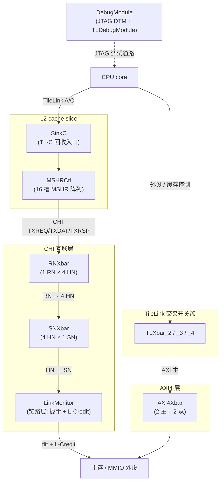

# uncore 架构总览 —— 非核互联子系统为什么这么设计

> 本文是香山 V2R2 昆明湖处理器 **uncore(非核互联)** 子系统的**背景层总览**:先讲清整个子系统由哪几类模块构成、它们**为什么这么设计**、在片上数据流里各自站在什么位置、又如何协同;不重复各模块的端口 / 实现细节——那些在逐模块设计文档 `../<Module>.md` 里。建议先读本文建立全局认知,再按文末阅读顺序深入各模块。

## 一、uncore 是什么、边界在哪

在这套 RTL 里,「uncore」不是一颗完整 SoC 的所有非核逻辑,而是**从 Chisel 生成物里挑出、经手工可读重写并做 UT+FM 双验证的那一批非核模块**,统一放在 `../../../rtl/uncore/*.sv`。它们跨越了几个不同的上游来源(rocket-chip 的 TileLink/AXI4/Debug、OpenLLC 的 CHI 交叉开关与链路层、coupledL2 的 L2 slice 组件),因而**协议异构、功能各异**,但共同点是:都属于「核外、把数据从一处搬到另一处或把总线协议互转」的**互联 / 胶合层**逻辑。

理解 uncore 的关键是抓住一条主线:**片上访存请求从 core 出发,要经过若干层总线协议,最终落到主存或外设**。不同层用不同协议(TileLink 管外设与缓存控制、CHI 管一致性互联、AXI4 管大内存 / MMIO),每换一层协议或每做一次「一对多 / 多对一」的分发汇聚,就需要一个交叉开关或一个协议转换器。uncore 里的模块基本都在这条主线的某个接缝上。

按职责,本子系统的模块分成**四类**:

| 类别 | 作用 | 协议 |
|------|------|------|
| ① 片上互联交叉开关族 | 一对多分发 / 多对一汇聚,连接总线上的主口与从口 | TileLink / AXI4 / CHI |
| ② CHI 链路层 | 把上层 ready/valid 握手与物理链路的 flit + L-Credit 协议互转 | CHI |
| ③ L2 slice 侧辅助叶子 | L2 缓存 slice 的组成部件(MSHR 控制阵列、C 通道接收器) | TileLink / CHI |
| ④ 调试子系统 | 外部 JTAG → 片上调试模块,经 DMI 相连 | JTAG / DMI / TileLink |

## 二、四类模块在片上数据流中的位置

下图给出一次访存请求穿过各层协议时,uncore 各类模块所处的接缝(仅示意协议流向与模块归属,不代表精确端口连接):

四类模块各自的定位:

- **① 交叉开关族**站在每一次「一对多 / 多对一」的接缝上——它们本身不改协议语义,只做**路由(按地址或事务 ID 选目标)+ 仲裁(多路争用择一)+ ready 解复用**。
- **② CHI 链路层**站在 CHI 互联与物理链路之间,是整条 CHI 通路的**最外一环**:上层用的是 ready/valid 握手,链路上跑的是 flit + L-Credit 信用流控,LinkMonitor(及其子模块)负责这两者互转与链路激活管理。
- **③ L2 slice 辅助叶子**并不在互联主干上,而是 **L2 cache slice 内部**的组成部件;之所以落在 `rtl/uncore` 目录,是因为它们与上面的重写 / 验证流程同批处理。它们是 core 侧请求进入 CHI 之前的最后一段 L2 逻辑。
- **④ 调试子系统**是一条**旁路**:它不参与访存数据流,而是从外部 JTAG 引脚接入,经 DMI 桥连到片上调试模块,再通过 TileLink 访问系统总线、并对 hart 发起 halt / reset。

## 三、逐类原理:为什么这么设计

### ① 交叉开关族:同一套「路由 + 仲裁 + 解复用」骨架,三种协议实例化

交叉开关是 uncore 里数量最多的一类,横跨三种总线协议,但它们共享同一套设计骨架:**上行按路由键分发(1→N)、下行做仲裁(N→1)、再按胜者把 ready 解复用回去**。三种协议的差异只在「路由键是什么」「字段集有多宽」「仲裁本体是否内联」上:

- **TileLink 族(TLXbar_2/3/4)**:路由**靠地址译码**(rocket-chip 的 `AddressSet` 匹配),下行 D 通道用 **round-robin 公平仲裁**(优先级掩码前缀 OR 算法)。三个变体是同一 `TLXbar` 的不同实例:`TLXbar_2` 是 1 主 × **5** 从的外设总线(重点在 5 路 round-robin);`TLXbar_3` 是 1 主 × 2 从的最小 TL-UL 实例(单拍访问,beat 计数退化);`TLXbar_4` 是 1 主 × 2 从的完整 TL-C 缓存控制总线(out0 是 `AddressSet(0x38022000, 0x7f)` 的 CacheCtrl 寄存器区,out1 是其补集)。这三者恰好覆盖了「路由数量」「字段口径(UL vs C)」「地址映射(catch-all 补集)」三个维度的变化。

- **AXI4Xbar**:是**多主 × 多从**(2 主 × 2 从)的大型交叉开关,比 TileLink 族多出 AXI 独有的复杂度——**ID 重映射 / 还原**(把主口号前缀进 AXI ID 以区分两主口,响应据 ID 高位还原目标)、**per-ID 顺序保持**(同 ID 请求不得落到不同从口而破坏 AXI 顺序保证)、**AW/W 同步**(写地址通道与写数据通道分离,需要队列跟踪配对)。这些是 AXI 协议语义强加的,交叉开关必须内建才能保序。

- **CHI 族(RNXbar / SNXbar)**:CHI 是**六通道**协议(TXREQ/TXRSP/TXDAT + RXSNP/RXRSP/RXDAT),交叉开关须对全 6 通道分别处理。**关键区别是路由键靠事务 ID 不靠地址**:CHI 下行应答用 `txnID` 高 2 位([10:9])回送到发起 HN,因为同一物理地址可能被多个 HN 访问,只有事务 ID 能唯一区分应答归属。
  - **RNXbar**(1 RN × 4 HN):上行按 `addr[7:6]`(TXREQ)或 `txnID[10:9]`(TXRSP/TXDAT)把请求拆分到 4 个 HN bank;下行 4→1 仲裁回 RN。它比 SNXbar 多一个**真状态机**:每个 HN bank 有一个 1 深 snoop 槽(`snpReqs`/`snpMasks`),把 snoop 载荷锁存一拍再仲裁,并按上游算出的目标掩码决定 snoop 是投递还是过滤丢弃。
  - **SNXbar**(4 HN × 1 SN):CHI 网络里最简单的交叉开关——4 个 HN 汇聚到 1 个 SN(主存控制器),纯连线 + 仲裁,无状态机。

三种协议的仲裁本体处理方式也不同:TileLink 族**自己重写** round-robin;CHI 族把仲裁交给黑盒 `FastArbiter`(它同时完成「选胜者」与「搬 flit」);AXI4Xbar 用 8 把 2 路 round-robin(每从口 AW/AR 各一、每主口 R/B 各一)。这解释了为什么读 CHI xbar 文档时看到的是「连线 + 状态机」而 TileLink xbar 文档里是「仲裁算法本身」。

### ② CHI 链路层:握手世界与信用世界的边界

CHI 通路的最外一环是**链路层**,由 `LinkMonitor` 及其 6 个子模块构成。它解决的问题是:**上层用 ready/valid 握手,而 CHI 物理链路用 flit + L-Credit 信用流控**,两者必须互转。

- **信用互转由子模块黑盒完成**:3 个上行 `Decoupled2LCredit{,_1,_2}`(txreq/txrsp/txdat,握手 → flit)+ 3 个下行 `LCredit2Decoupled{,_1,_2}`(rxsnp/rxrsp/rxdat,flit → 握手)。L-Credit 的语义是:接收方每发一个 `lcrdv` 脉冲授予发送方 1 个信用,发送方有信用才能拉 `flitv` 发一个 flit。
- **LinkMonitor 本体是「真时序 glue」**,只管四件事:**LINKACTIVE 链路激活状态机**(STOP → ACTIVATE → RUN → DEACTIVATE → STOP 四态,由对端 `{linkactivereq, linkactiveack}` 两根线译码)、**L-Credit 回收时序**(去激活前必须先还清所有信用,否则丢信用——这是 `rx.linkactiveack` 不能在对端撤请求时立刻撤下的原因)、**系统一致性握手**(`syscoreq`/`syscoack`)、以及**给上行 flit 注入本节点 CHI nodeID**。

理解链路层的要点:它**不改数据、不做路由**,纯粹是协议边界上的时序管理。它站在 SNXbar 之后、物理链路之前,是 CHI 数据离开芯片前的最后一道逻辑。

### ③ L2 slice 侧辅助叶子:进入 CHI 之前的最后一段一致性逻辑

`MSHRCtl` 和 `SinkC` 名义上在 uncore 目录,实际是 **L2 cache slice**(见 `../../l2/Slice.md`)的组成部件。它们处在 core 请求转成 CHI 事务之前的位置:

- **SinkC**:L2 一致性数据**回收路径的入口**。把 DCache 经 TileLink C 通道送来的 `Release/ProbeAck` 归一成内部 `TaskBundle`,并把脏数据缓存进缓冲区供后续写回。它有 4 个缓冲块、每块 2 拍(256 bit/拍),处理 `Release/ReleaseData`(生成 task 发往 RequestArb)、`ProbeAck/ProbeAckData`(唤醒 MSHR + 写 ReleaseBuffer)、以及 refill 数据冒险三条通路。

- **MSHRCtl**:L2 slice 的 **MSHR 控制阵列**,把 **16 个 MSHR 槽**组织成资源池。它负责:**分配**(给 MainPipe 选空闲槽)、**响应路由**(把 CHI/TileLink/嵌套回写各路响应按 `mshrId` 或 PA 派发进对应槽)、**下行/上行仲裁**(各槽的 txreq/txrsp/source_b/mainpipe 任务经 4 把 FastArbiter 汇聚出口)、**容量背压**(占满 15 槽时阻塞 SinkA、占满 16 槽阻塞 SinkB,**为 snoop/probe 预留最后 1 槽防死锁**)。它正是把 core 侧 miss 转成 CHI TXREQ 发往 RNXbar 的地方。

这两个模块解释了 core 请求「进入 CHI 之前」发生了什么:先经 L2 一致性处理(回收 / miss 分配),再由 MSHR 阵列产出 CHI 请求交给 CHI 交叉开关。

### ④ 调试子系统:一条横跨三时钟域的旁路

`DebugModule` 是 SoC 的调试入口顶层装配壳。它本身几乎没有功能逻辑(唯一的时序逻辑是把 hart 复位电平打一拍对齐),真正的调试功能全在它例化的两个子模块里:

- **DTM(`DebugTransportModuleJTAG`)**:标准 JTAG TAP,把外部调试器经 JTAG 扫描进来的指令(IDCODE / DTMCS / DMI)译成 **DMI 请求**,收应答后移位回 TDO。全程 TCK 域。
- **DM 主体(`TLDebugModule`)**:内含 DM 寄存器组、抽象命令执行、program buffer、system bus access(SBA)master、per-hart reset 控制;对 CPU 暴露 TileLink slave 口,对外暴露 TileLink master 口。

两者用 **DMI 总线**相连(DTM 是请求方、DM 是应答方,`op` = NOP/READ/WRITE,`resp` = SUCCESS/FAILED/BUSY)。调试子系统天然横跨**三个时钟域**(TL/CPU 时钟、DM 内核时钟、JTAG TCK),跨域同步在子模块内部用异步 FIFO / 时钟穿越寄存器完成。理解要点:它是一条独立于访存数据流的**带外通路**,通过 DMI 桥把慢速 JTAG 世界接到片上快速调试逻辑。

## 四、模块清单与阅读顺序

### 模块清单

| 类别 | 模块 | 一句话定位 | 设计文档 | RTL |
|------|------|-----------|----------|-----|
| ① Xbar (TileLink) | TLXbar_2 | 1 主 × 5 从外设总线,5 路 round-robin | [../TLXbar_2.md](../TLXbar_2.md) | [../../../rtl/uncore/TLXbar_2.sv](../../../rtl/uncore/TLXbar_2.sv) |
| ① Xbar (TileLink) | TLXbar_3 | 1 主 × 2 从最小 TL-UL 实例,单拍 | [../TLXbar_3.md](../TLXbar_3.md) | [../../../rtl/uncore/TLXbar_3.sv](../../../rtl/uncore/TLXbar_3.sv) |
| ① Xbar (TileLink) | TLXbar_4 | 1 主 × 2 从缓存控制总线,完整 TL-C | [../TLXbar_4.md](../TLXbar_4.md) | [../../../rtl/uncore/TLXbar_4.sv](../../../rtl/uncore/TLXbar_4.sv) |
| ① Xbar (AXI4) | AXI4Xbar | 2 主 × 2 从,ID 重映射 + 保序 | [../AXI4Xbar.md](../AXI4Xbar.md) | [../../../rtl/uncore/AXI4Xbar.sv](../../../rtl/uncore/AXI4Xbar.sv) |
| ① Xbar (CHI) | RNXbar | 1 RN × 4 HN,含 snoop 跟踪状态机 | [../RNXbar.md](../RNXbar.md) | [../../../rtl/uncore/RNXbar.sv](../../../rtl/uncore/RNXbar.sv) |
| ① Xbar (CHI) | SNXbar | 4 HN × 1 SN,最简汇聚 | [../SNXbar.md](../SNXbar.md) | [../../../rtl/uncore/SNXbar.sv](../../../rtl/uncore/SNXbar.sv) |
| ② CHI 链路层 | LinkMonitor | 链路激活握手 + L-Credit 流控互转 | [../LinkMonitor.md](../LinkMonitor.md) | [../../../rtl/uncore/LinkMonitor.sv](../../../rtl/uncore/LinkMonitor.sv) |
| ③ L2 辅助叶子 | MSHRCtl | 16 槽 MSHR 控制阵列 | [../MSHRCtl.md](../MSHRCtl.md) | [../../../rtl/uncore/MSHRCtl.sv](../../../rtl/uncore/MSHRCtl.sv) |
| ③ L2 辅助叶子 | SinkC | TileLink C 通道回收入口 | [../SinkC.md](../SinkC.md) | [../../../rtl/uncore/SinkC.sv](../../../rtl/uncore/SinkC.sv) |
| ④ 调试子系统 | DebugModule | JTAG DTM + TLDebugModule 装配 | [../DebugModule.md](../DebugModule.md) | [../../../rtl/uncore/DebugModule.sv](../../../rtl/uncore/DebugModule.sv) |

> 目录 `../../../rtl/uncore/` 下还有一批**未单独出设计文档的模块**(CLINT / PLIC / IMSIC 中断控制器、L2 slice 主体 L2Slice / MainPipe / Directory / SubDirectory、CHI 收发通道 RXREQ/TXDAT 等、FastArbiter 系列黑盒、以及各 `*_pkg.sv` / `*_wrapper.sv`)。它们或作为上表模块的黑盒子模块被例化,或属于别的子系统(L2 主体见 `../../l2/`)。本总览只覆盖已出逐模块文档的那批。

### 建议阅读顺序

1. **先读交叉开关族**建立「路由 + 仲裁 + 解复用」骨架认知:从最简单的 [TLXbar_3](../TLXbar_3.md)(单拍、2 从)入手,再看 [TLXbar_4](../TLXbar_4.md)(完整 TL-C)、[TLXbar_2](../TLXbar_2.md)(5 路仲裁),体会同一骨架的三种维度变化。
2. **再看协议差异**:[AXI4Xbar](../AXI4Xbar.md) 理解多主保序四件套;[SNXbar](../SNXbar.md) → [RNXbar](../RNXbar.md) 理解 CHI 六通道 + snoop 状态机(SNXbar 简单先读,RNXbar 含状态机后读)。
3. **顺着 CHI 通路往外**:读 [LinkMonitor](../LinkMonitor.md) 理解 CHI 到物理链路的握手 ↔ 信用边界。
4. **回到 L2 侧**理解 CHI 请求从哪来:[SinkC](../SinkC.md)(回收入口)→ [MSHRCtl](../MSHRCtl.md)(MSHR 阵列产出 CHI 请求);需要 L2 全貌可参考 [../../l2/Slice.md](../../l2/Slice.md)。
5. **最后读带外通路**:[DebugModule](../DebugModule.md) 独立于访存主干,可随时单独阅读。

### 延伸阅读

- L2 cache slice 全貌与 CHI 通道细节:[../../l2/Slice.md](../../l2/Slice.md)、[../../l2/CHIChannels.md](../../l2/CHIChannels.md)
- 交叉开关反复用到的公共构件(SRAM 模板、流水连接等):见 [../../common/](../../common/) 下各文档
