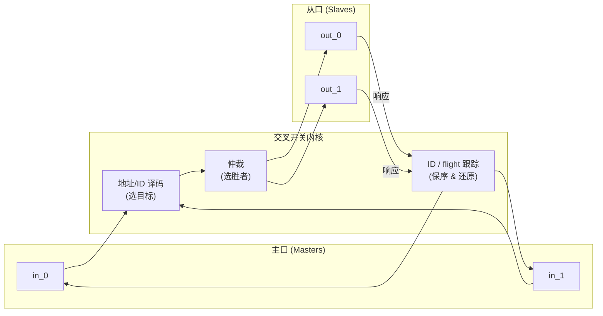
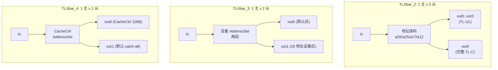
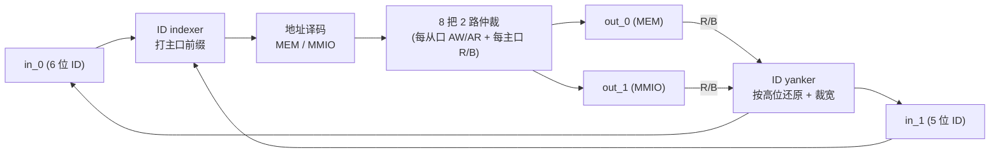
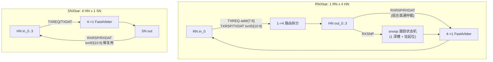

# 互联交叉开关(Xbar)原理

> 本文是 uncore 互联层的**背景/原理文档**:讲清楚交叉开关「为什么这么设计、内部各环节如何协同」,
> 帮你在读逐模块设计文档前先建立整体认知。具体端口、地址常量与逐拍实现,请转对应模块文档。
> 上一层总览见 [`0-UNCORE_OVERVIEW.md`](0-UNCORE_OVERVIEW.md)。

香山 V2R2 昆明湖的非核互联里,同一个「交叉开关」抽象跨越了三类总线协议:片内外设/内存走
**TileLink** 与 **AXI4**,缓存一致性网络走 **CHI**。它们的实现细节差异很大(通道数、ID 语义、
背压方式),但都在解决同一件事:**让多个主口与多个从口共享一组物理连线,按地址/ID 正确路由,
并在争用时公平仲裁**。理解了这套通用骨架,再看六个 Xbar 变体(TLXbar_2/3/4、AXI4Xbar、
RNXbar、SNXbar)就只是「同一原理在不同协议下的取舍」。

---

## 1. 交叉开关要解决的四个问题

一个 M 主 × N 从的交叉开关,本质是一张「谁能和谁通话」的可切换连接网。它必须同时处理四件事:



1. **地址译码 / 路由(请求方向)**:主口发出的请求带一个地址,内核要判定它落在哪个从口的地址窗口,
   把请求转发过去。译码常用 rocket-chip 的 `AddressSet(base, mask)` 语义——「care 位需匹配 base,
   don't-care 位任意」;通常还会指定一个**默认从口(catch-all)**兜住所有未命中的地址,并用
   `request[默认] = ~request[其余]` 的互补表达式避免地址空洞。

2. **仲裁(请求与响应方向)**:当多个主口同时想访问同一从口(或多个从口同时想应答同一主口),
   必须择一放行。香山用两种策略:**round-robin**(公平轮转,防饿死)和**固定优先级/掩码轮转**
   的变体。见第 2 节。

3. **ID 管理与 flight 跟踪**:响应回来时,内核要知道「这个响应属于哪个主口、哪笔请求」。TileLink 用
   `source`、AXI4 用 `id`、CHI 用 `txnID`——都是「路由靠地址下行、回程靠 ID 还原」。多主口场景还要
   **重映射 ID**(给不同主口打前缀避免撞号)并在回程**还原/裁回**原宽。

4. **多 beat 锁定**:一笔访问可能跨多个数据拍(burst / 多 beat)。仲裁一旦选中某主口,必须**锁住**该
   通路直到整笔传完,中途不能被别的主口插入,否则数据会交错。香山外设侧的 TileLink 从口多为**单拍**
   访问,故 beat 计数 / 锁定逻辑退化(恒 idle),但代码仍如实保留以与 golden 逐位等价。

---

## 2. 仲裁:round-robin 的两种写法

香山 Xbar 家族里,round-robin 有两套等价实现,分别对应 TileLink/AXI 与 CHI 两条链路:

### 2.1 前缀 OR 掩码(TileLink / AXI4)

rocket-chip 的 `TLArbiter.roundRobin`(见 `Arbiter.scala`)用一个**优先级掩码寄存器** `mask` 记住
「谁刚被服务过,下一轮该降到最低优先级」。核心是一段前缀 OR 运算求出「被更高优先者抢占」的集合:

```
mask    : 优先级掩码寄存器 (RegInit 全 1)
filter  = {valid & ~mask, valid}                    // 2N 位: 高半区是"本轮优先者"
unready = (rightOR(filter) >> 1) | (mask << N)      // 前缀 OR
grant   = ~( unready[2N-1:N] & unready[N-1:0] )     // N 位 one-hot 授权
胜者更新: 若本拍 latch 且有请求, mask <= leftOR(grant & valid)
```

`leftOR`/`rightOR` 是把置位「向高位/低位传播」的前缀 OR,只需 `log2(N)` 步。香山可读核把 firtool
展开后那串多级移位异或(`_GEN_0`/`_GEN_1`/`_T_n`)**还原成参数化 `for` 循环**,再用 FM 证明与
golden 逐位等价——所以读代码时看到的是干净的 `rightOR(filter, 2N, cap=N)`,而非位掩码天书。

### 2.2 挂起记忆 + 优先区推进(CHI 的 FastArbiter)

CHI 侧的 `FastArbiter`(`fastarbiter_pkg.sv`)是「带挂起记忆的 round-robin」:

```
pendingMask : 上一拍 "valid 但未被选中" 的输入 (本轮欠服务者)
rrGrantMask : 优先区掩码 = "上次胜者下标之后" 的所有下标
rrSelOH     = lowest_oh(rrGrantMask & pendingMask)  // 优先服务欠债者
pendingMask <= valids & ~chosenOH                   // 未选中者转入欠服务
rrGrantMask <= gt_mask(chosenOH)                    // 优先区推进到本次胜者之后
```

它同时兼任 **payload 多路选择器**:选出 `io_chosen`(胜者下标)后,直接把胜者 flit 搬到
`io_out_bits_*`,所以 CHI Xbar 内核**不需要显式的 one-hot mux**,只需据 `io_chosen` 把 ready
解复用回胜者。RNXbar/SNXbar 把 `FastArbiter` 当**黑盒**例化,内核只负责打包输入与解复用 ready。

---

## 3. 三类总线的取舍对比

| 维度 | TileLink | AXI4 | CHI |
|------|----------|------|-----|
| 通道 | A(请求下行)/ D(响应上行),外加 TL-C 的 B/C/E | 5 通道:AW/AR(地址)、W(写数据)、R(读数据)、B(写响应) | 6 通道:TXREQ/TXRSP/TXDAT(上行)、RXSNP/RXRSP/RXDAT(下行) |
| 下行路由靠 | **地址**(`AddressSet` 译码) | **地址**(译码到 MEM/MMIO) | **地址**(TXREQ 按 `addr[7:6]`)或 **txnID**(TXRSP/TXDAT/回程按 `txnID[10:9]`) |
| 回程还原靠 | `source` | `id`(多主口需重映射 + yank) | `txnID` / `srcID` |
| 保序需求 | 单拍为主,退化 | **per-ID 顺序保证**(需 FIFO map) | 事务 ID 天然区分 |
| 一致性 snoop | 无(外设总线) | 无 | **有**(RXSNP + snoop 跟踪) |
| 仲裁实现 | 前缀 OR 掩码 | 前缀 OR 掩码(N=2 特化 `rr2`) | FastArbiter(挂起记忆) |

一句话:**TileLink Xbar 最薄**(单主/单拍居多,只剩地址译码 + round-robin);**AXI4Xbar 最重**
(多主口带来 ID 重映射 + per-ID 保序 + AW/W 同步);**CHI Xbar 分两侧**——请求节点侧(RNXbar)
多一套 snoop 分发状态机,子节点侧(SNXbar)最简单(纯仲裁 + txnID 解复用)。

---

## 4. 六个变体:同一原理的不同切面

### 4.1 TileLink 三兄弟(TLXbar_2 / _3 / _4)

三者都是**单主口**(无 A 仲裁,主口直连译码器),差异在从口数、端口口径与仲裁宽度:



- [`TLXbar_2`](../TLXbar_2.md)——外设总线,**1 主 × 5 从**,30 位地址。五个从口口径不一(只有 out4 是
  完整 TL-C,out0..out3 是 TL-UL,缺失字段填 0)。看点是 **5 路 round-robin**(`cap=N=5`,前缀 OR 做
  `s=1,2,4` 三步)。
- [`TLXbar_3`](../TLXbar_3.md)——**1 主 × 2 从** TL-UL 最小实例,32 位单字访问、恒单拍。out1 是只有
  16 个地址的设备小区间(两段 `AddressSet`),out0 是其补集(默认 sink)。仲裁退化到只剩 2 路
  round-robin 公平掩码。
- [`TLXbar_4`](../TLXbar_4.md)——缓存控制总线,**1 主 × 2 从** 完整 TL-C。out0 是 CacheCtrl 寄存器区
  `AddressSet(0x38022000, 0x7f)`(128 字节),out1 是它在 48 位空间的补集。两从口 D 字段对称,故用
  统一载荷结构。

> 三者的 `beatsLeft`/`lock_state` 在单拍配置下恒不生效,但都如实保留以便 FM 逐寄存器配对。

### 4.2 AXI4Xbar:多主 ID 重映射的重量级 Xbar

[`AXI4Xbar`](../AXI4Xbar.md) 是 **2 主 × 2 从**(内存 MEM + 外设 MMIO),相对单主的
`AXI4Xbar_1`(1×5)多出「四件套」,正是第 1 节四个问题在多主场景下的完整体现:



- **[A] ID indexer/yanker**:上行给 `in_0` 打 `{1'b0,id6}`(落 `[0,64)`)、`in_1` 打 `{2'b10,id5}`
  (落 `[64,96)`),下行按 ID 高位还原目标主口再裁回原宽——解决 flight 跟踪与 ID 撞号。
- **[B] 8 把 2 路 round-robin 仲裁器**:AXI 五通道各自独立流控,每从口 AW/AR 各一把、每主口 R/B
  各一把(共 8 把),`idle`/`state` 寄存器在下游 stall 时锁住当拍胜者。
- **[C] per-ID 顺序保持(FIFO map)**:每个在飞 ID 记 `count`(在飞笔数)/`last`(锁定从口),放行门
  `= (count==0 | last==目标) & count!=7`——防止同 ID 的多笔请求落到不同从口、响应交错破坏 AXI
  同 ID 保序。
- **[D] AW/W 同步**:AXI 的写地址(AW)与写数据(W)是两条通道,必须让 W 跟随对应 AW 的路由;用
  `awIn`/`awOut` 两条队列记录命中从口与胜出主口。

> 注意:AXI 的**交织拆分**由独立的 `AXI4Deinterleaver` 适配器完成,**不在 Xbar 本体内**。

### 4.3 CHI 两侧:RNXbar(请求节点) vs SNXbar(子节点)

CHI 网络按位置分两类 Xbar。二者都把 `FastArbiter` 当黑盒,内核只做路由/打包/解复用:



- [`RNXbar`](../RNXbar.md)——**1 RN × 4 HN**,全 6 通道。上行 TXREQ 按 `addr[7:6]`、TXRSP/TXDAT 按
  `txnID[10:9]` 把请求拆到 4 个 HN bank(每通道 4 把单输入仲裁器)。它相对 SNXbar 的**核心增量**是
  **snoop 跟踪状态机**:每个 bank 一个 1 深 snoop 槽,`snpReqs_j` 锁存 snoop 载荷、`snpMasks_j` 是
  「仍需投递给 RN」的挂起位;上游给出的 `io_snp_mask_set_j` 决定 snoop 是**投递**(mask=1,进仲裁)
  还是**一拍内过滤丢弃**(mask=0,立即释放槽)。
- [`SNXbar`](../SNXbar.md)——**4 主 × 1 从**,CHI 里最简单的 Xbar。上行 TXREQ/TXDAT 各一把
  `FastArbiter` 汇聚到唯一从口,下行 RXRSP/RXDAT 按 `txnID[10:9]` 解复用回源 HN(OpenLLC 下发请求时
  把源 HN 的 2 位编号塞进 `txnID[10:9]`)。**路由靠 txnID 不靠地址**——因为同一物理地址可能被多个 HN
  访问,只有事务 ID 能唯一区分应答归属。

---

## 5. 香山 Xbar 的重写约定

以上变体都遵循同一套「可读重写」规矩,读代码时应有的预期:

- **从设计意图重写**:地址译码回到 `AddressSet` 语义、仲裁回到参数化前缀 OR / 挂起记忆算法,而非
  照抄 firtool 展平后的位掩码异或。
- **退化逻辑如实保留**:单拍从口的 `beatsLeft`/`lock_state`、恒真的 ready OR 结构都保留,以便与
  golden 逐寄存器 / 逐端口配对。
- **黑盒边界清晰**:CHI 的 `FastArbiter`、AXI 的 `Queue2_UInt2` 等在核内例化为黑盒,FM 按同名黑盒
  自动配对,比对聚焦本核的路由/解复用逻辑。
- **等价性双证**:每个变体都有 UT(golden vs 可读核双例化,多 seed × 20 万拍)与 FM(compare
  point 全 passing)两道闸门——具体数字见各模块文档。

---

## 相关文档

- 逐模块设计:[`TLXbar_2`](../TLXbar_2.md) · [`TLXbar_3`](../TLXbar_3.md) · [`TLXbar_4`](../TLXbar_4.md) ·
  [`AXI4Xbar`](../AXI4Xbar.md) · [`RNXbar`](../RNXbar.md) · [`SNXbar`](../SNXbar.md)
- 子系统总览:[`0-UNCORE_OVERVIEW.md`](0-UNCORE_OVERVIEW.md)
- RTL:[`TLXbar_2.sv`](../../../rtl/uncore/TLXbar_2.sv) · [`TLXbar_3.sv`](../../../rtl/uncore/TLXbar_3.sv) ·
  [`TLXbar_4.sv`](../../../rtl/uncore/TLXbar_4.sv) · [`AXI4Xbar.sv`](../../../rtl/uncore/AXI4Xbar.sv) ·
  [`RNXbar.sv`](../../../rtl/uncore/RNXbar.sv) · [`SNXbar.sv`](../../../rtl/uncore/SNXbar.sv) ·
  [`fastarbiter_pkg.sv`](../../../rtl/uncore/fastarbiter_pkg.sv)
