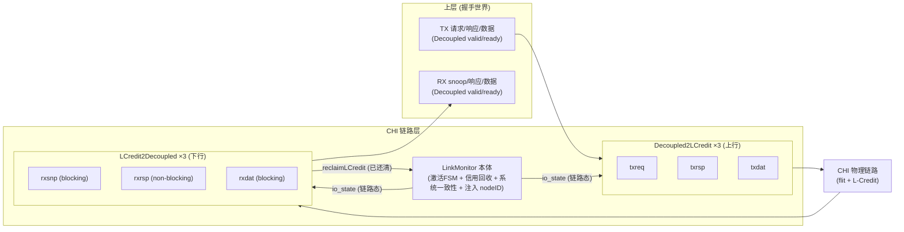
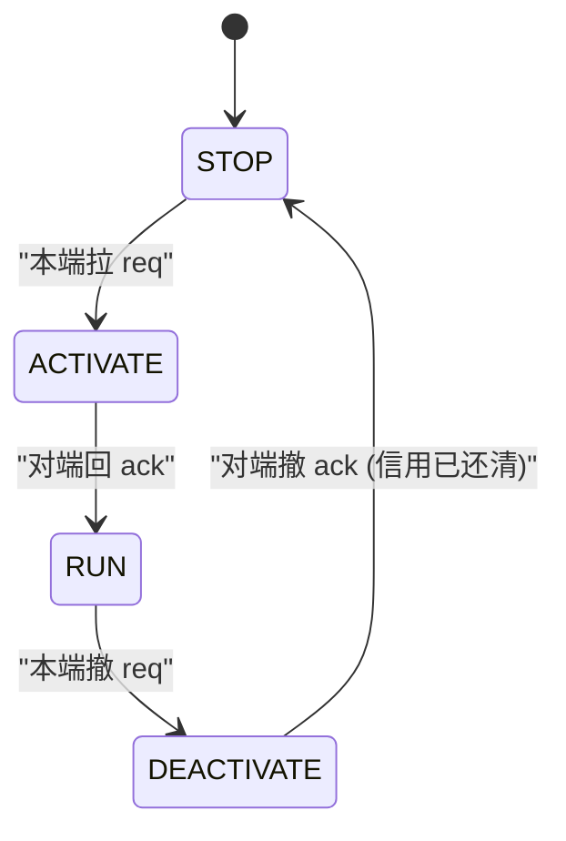
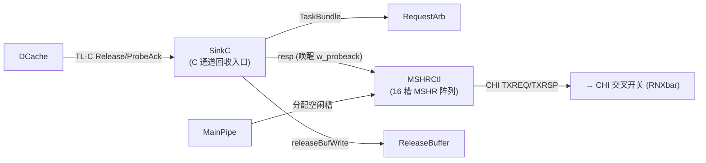
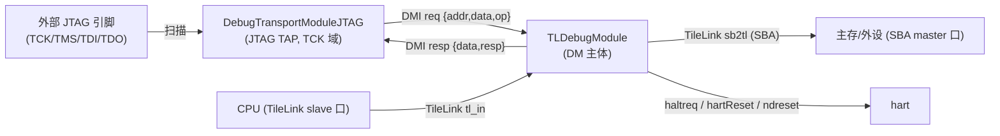
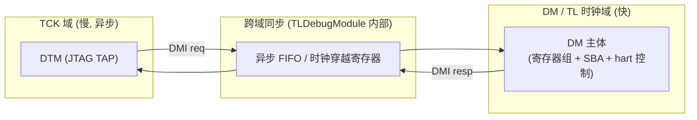

# CHI 链路层与调试子系统原理

> 本文是香山 V2R2 昆明湖处理器 **uncore(非核互联)** 子系统的**背景/原理篇**,聚焦两块「协议边界」逻辑:**CHI 链路层**(把上层 ready/valid 握手与物理链路的 flit + L-Credit 信用流控互转)与**调试子系统**(把慢速 JTAG 世界经 DMI 桥接到片上快速调试逻辑)。它讲清楚这两块**为什么这么设计、各模块如何协同**,并顺带交代 L2 侧两个辅助叶子(MSHRCtl / SinkC)在 slice 中的角色;不重复各模块的端口 / 实现细节——那些在逐模块设计文档 `../<Module>.md` 里。建议先读本目录总览 [`0-UNCORE_OVERVIEW.md`](0-UNCORE_OVERVIEW.md) 建立全局认知,再读本篇。

---

## 一、为什么需要一个「链路层」

CHI(Coherent Hub Interface)互联的**上层**用的是大家熟悉的 ready/valid 握手(Decoupled):有数据就拉 `valid`,对方能收就给 `ready`,同拍两高即成交。但 CHI **物理链路**上跑的不是握手,而是 **flit + L-Credit(Link Credit,链路信用)**:

- **flit** 是链路上一拍传输的固定净荷,每个 CHI 通道各有自己的 flit 格式;
- **L-Credit** 是一种**预授信**的反压机制:发送方**必须先持有信用**才能发 flit,信用由接收方逐个授予。这样接收方永远不会因缓冲溢出而丢包——它只在自己收得下时才发信用。

握手世界与信用世界语义不同,必须在两者之间架一层转换。这层就是**链路层**,由 `LinkMonitor`(见 [`../LinkMonitor.md`](../LinkMonitor.md))与它例化的 6 个 flit 转换子模块共同构成。本设计里的 `LinkMonitor` 是 **RN 侧**链路层(`LinkMonitor.sv` 头注即注明「RN 侧」)，位于 L2/RN 接入 CHI 的端口——上行发 TXREQ、下行收 RXSNP 均为 RN 特征；它在**请求发起侧**，而非 SNXbar/主存那一侧。它**不改数据、不做路由**,纯粹是协议边界上的时序管理——路由 / 仲裁那套骨架在交叉开关篇 [`1-INTERCONNECT_XBAR_PRINCIPLES.md`](1-INTERCONNECT_XBAR_PRINCIPLES.md) 里讲。

链路层的职责按「谁做什么」可以一刀切成两半:

| 谁 | 做什么 |
|----|--------|
| **6 个子模块** | 逐通道的 **flit ↔ 握手转换** + **L-Credit 记账**(信用池、发信用、退信用) |
| **LinkMonitor 本体** | **链路激活状态机** + **信用回收时序** + **系统一致性握手** + **注入本节点 ID**;不碰单个 flit |



---

## 二、LinkMonitor:链路激活握手 + 信用回收

`LinkMonitor` 本体是「真时序 glue」而非纯连线,它只管四件事,其中前两件是链路层的**核心时序**。

### 2.1 LINKACTIVE 四态激活握手

链路不是上电就能收发,必须先「激活」。CHI 链路层用一个 **4 态状态机**描述链路状态,状态**完全由对端的两根握手线 `{linkactivereq, linkactiveack}` 译码得出**(见 `linkmonitor_pkg.sv` 的 `link_state` 函数):

| `{req, ack}` | 链路态 | 含义 |
|:------------:|:------:|------|
| `00` | **STOP** | 链路停止 |
| `10` | **ACTIVATE** | 已请求激活,待对端确认 |
| `11` | **RUN** | 可正常收发 flit |
| `01` | **DEACTIVATE** | 已撤请求,待对端撤确认 |

正常生命周期是一个环:



LinkMonitor 对 TX、RX 两个方向各维护一份状态,用**同一个译码函数**折叠成 `link_st[DIR_TX]` / `link_st[DIR_RX]` 数组循环(对应 Scala 的 `Seq(txState, rxState)`)。译码出的链路态经 `io_state_state` 下发给 6 个子模块,子模块据此决定**能否发 / 收 flit、何时回收信用**:

- 对上行 `Decoupled2LCredit`:`STOP`/`ACTIVATE` 时 `disableFlit`(不接收上游 flit)、`STOP` 时 `disableLCredit`(不消费对端信用);只有 `RUN` 才正常发。
- 对下行 `LCredit2Decoupled`:只有 `RUN` 才 `lcreditOut`(向对端发信用)。

本端的策略很简单:`tx.linkactivereq` **恒高**(本端总想激活 TX 链路)。真正微妙的是 RX 侧撤 ack 的时序——见下。

### 2.2 L-Credit 回收:去激活前必须先还清信用

信用是一种「已经发出去但对端还没用掉」的承诺。如果链路在**还有信用在途**时贸然关闭,那些信用就凭空丢失了,对端会永远以为自己还能发那么多 flit。所以 CHI 规定:**去激活必须先还清所有在途信用**。

这落到 RTL 上就是 LinkMonitor 最关键的一处时序——对端撤下 `rx.linkactivereq` 后,本端的 `rx.linkactiveack` **不能立刻撤**:

```
rx_linkactiveack_q <= rx_linkactiveack_d | ~rx_deact
rx_deact = rxsnp_reclaim & rxrsp_reclaim & rxdat_reclaim   // 三个 RX 通道信用全还清
```

`| ~rx_deact` 的意思是:只要还有任一 RX 通道没还清(`reclaim` 未全 1),ack 就维持高、链路留在 DEACTIVATE,不许落回 STOP。每个下行子模块用 `reclaimLCredit = (lcreditInflight == 0)` 回报「我这条通道的信用已全部收回」。三个通道全回报后才允许关闭。这正是「链路层是时序管理层」的最典型体现——一个信号能不能撤,取决于三个子模块的记账状态。

### 2.3 系统一致性握手与 ID 注入(点到即止)

除激活与回收外,LinkMonitor 还负责两件辅助工作:

- **系统一致性握手**:`syscoreq` 恒高、由对端 `syscoack` 回握,派生出 `txsactive` 指示,表明本节点参与系统一致性域。
- **srcID 注入**:3 个上行子模块发 flit 时,其 `srcID` 字段恒接本节点的 CHI `nodeID`——链路层在出口处填上「这个 flit 来自谁」。

此外还有三个纯监测用的性能计数器(RetryAck / PCrdGrant / no-allowRetry 请求计数,无输出端口)。这些都是链路层的「附加职责」,不在数据主干上。

---

## 三、子模块:两个转换方向、两种缓冲策略

6 个子模块分两组,各 3 个,分别对应 CHI 的 3 个上行通道与 3 个下行通道。转换方向相反,但共享同一套 L-Credit 记账思路。

### 3.1 Decoupled2LCredit(上行:握手 → flit)

内部逻辑发送方视角:维护一个**信用池** `lcreditPool`(REQ 通道最多 15),对端每发一个 `lcrdv` 就 `+1`,本端每发一个 flit 就 `-1`。`in.ready = pool≠0 & ~disableFlit`——**有信用且链路允许**才向上游要数据。去激活时若上游没数据但池里还有多余信用,就用**空 flit(opcode=0=LCrdReturn)把信用退还**给对端。输出端 `flitpend`/`flitv`/`flit` 全部打一拍发出。

三个上行变体只在净荷宽度上不同:REQ payload 162 bit、RSP、DAT 各自的宽度。控制逻辑完全一致。

### 3.2 LCredit2Decoupled(下行:flit → 握手)

内部逻辑接收方视角:它是**授信方**,通过 `lcrdv` 脉冲逐个把信用发给对端。维护两个数:`lcreditInflight`(已发出、对端还没用掉的信用)与 `lcreditPool`(还能发的信用),不变式 **`inflight + pool ≡ lcreditNum`**。收到 flit(`accept = inflight≠0 & flitv`)时对端用掉一个信用;`RUN` 态且有富余时 `lcreditOut` 再发一个信用(`lcrdv` 打一拍发出)。`reclaimLCredit = (inflight == 0)` 就是上一节说的「信用已还清」回报。

收到的 flit 里 **opcode==0 的是对端退还的 LCrdReturn 空 flit**,直接吞掉、不往下游输出(`out.valid = ~isLCrdReturn & …`)。

**两种缓冲策略(blocking / non-blocking)** 是下行侧最值得注意的设计选择:

| 变体 | 通道 | payload | `lcreditNum` | blocking? | 缓冲 |
|------|------|:-------:|:------------:|:---------:|------|
| `LCredit2Decoupled` | SNP | 115 bit | 4 | **是** | 4 深 `Queue4_CHISNP` 队列 |
| `LCredit2Decoupled_1` | RSP | 73 bit | 15 | **否** | 无队列,直接解包 |
| `LCredit2Decoupled_2`(可读核文件 `_10.sv`) | DAT | 422 bit | 4 | **是** | 4 深 `Queue4_CHIDAT` 队列 |

- **blocking(阻塞)变体**:flit 先进一个 4 深队列,`lcreditOut = (pool > 队列已占) & RUN`——**只在队列留得下时才发信用**,从而保证「发出去的信用都对应可落地的队列表项」,下游可以慢慢消费而不丢数据。SNP / DAT 用它,因为下游未必立刻 ready。
- **non-blocking(非阻塞)变体**:无队列,`lcreditOut = pool≠0 & RUN`——只看信用池非空,**假定下游恒 ready**,收到 flit 当拍直接解包输出。RSP 用它,信用数也开得更大(15)以维持吞吐。

理解要点:**信用数与是否带缓冲队列,是按通道的下游消费特性调出来的**——响应通道快而恒收(非阻塞、大信用),snoop / 数据通道需要缓冲(阻塞、小信用配 4 深队列)。

---

## 四、L2 侧辅助叶子:进入 CHI 之前的最后一段一致性逻辑

`MSHRCtl` 与 `SinkC` 名义上在 uncore 目录,实际是 **L2 cache slice**(见 [`../../l2/Slice.md`](../../l2/Slice.md))的组成部件。它们处在「core 请求转成 CHI 事务之前」的位置——即上面 CHI 链路层的**上游**。放在这里,是为了让读者顺着 CHI 通路往回看:CHI 请求究竟从哪来。



### 4.1 SinkC:一致性数据的回收入口

`SinkC`(见 [`../SinkC.md`](../SinkC.md))是 L2 一致性数据**回收路径的入口**:把 DCache 经 TileLink C 通道送来的 `Release/ProbeAck` 事务归一成内部 `TaskBundle`,并把脏数据缓存进缓冲区供后续写回。它有 **4 个缓冲块、每块 2 拍(256 bit/拍)**,三条通路各司其职:

1. **Release / ReleaseData**:多拍数据写入 `dataBuf`,末拍生成一条 `TaskBundle` 投入 `taskBuf`,经轮询仲裁发往 RequestArb;
2. **ProbeAck / ProbeAckData**:经 `io.resp` **唤醒 MSHR 的 `w_probeack`**,数据整块写入 ReleaseBuffer;
3. **refill 数据冒险处理**:C-Release 带来的新数据可能先于 MSHR-Release 的旧 refill 写回,命中且 `blockRefill` 时把数据回写 refillBuf,保证后到的 refill 读到新数据。

它与 MSHRCtl 的协同点在于第 2 条:probe 的应答通过 SinkC 回流,唤醒对应 MSHR 槽里等待 probeack 的状态位。

### 4.2 MSHRCtl:16 槽 MSHR 控制阵列

`MSHRCtl`(见 [`../MSHRCtl.md`](../MSHRCtl.md))是 L2 slice 的 **MSHR 控制阵列**,把 **16 个 MSHR 槽**组织成一个资源池。它正是**把 core 侧 miss 转成 CHI TXREQ 发往 CHI 交叉开关**的地方。四项核心职责:

- **分配**:`MSHRSelector` 对空闲槽取最低位 one-hot,给 MainPipe 反馈空闲槽号;MainPipe 在 s3 拉高分配请求时锁存进选中槽。
- **响应路由**:CHI RXRSP/RXDAT 各路响应按其携带的 `mshrId` 命中唯一槽;而 SinkC 送来的 ProbeAck/Release **没有 mshrId,改用物理地址(PA)搜索**匹配槽——这正是 SinkC 与 MSHRCtl 的接口语义。
- **下行 / 上行仲裁**:各槽的 txreq / txrsp / source_b / mainpipe 任务经 **4 把 `FastArbiter`** 汇聚出口。`txreq_arb` 的出口就是发往 CHI 的 Acquire 请求。
- **容量背压(防死锁)**:占用 ≥15 槽时 `blockA` 阻塞普通 acquire(SinkA)、占用 ≥16 槽时 `blockB` 阻塞 snoop/probe(SinkB)——**为 snoop/probe 预留最后 1 槽**,避免普通请求占满导致一致性事务无法推进而死锁。

理解要点:这两个叶子解释了「core 请求进入 CHI 链路层之前」发生了什么——先经 SinkC 做一致性回收、经 MSHR 阵列做 miss 分配与仲裁,产出的 CHI 请求经 RN 侧链路层(第二节)转成 flit，再进 CHI 交叉开关发往 HN/SN。L2 全貌见 [`../../l2/Slice.md`](../../l2/Slice.md)。

---

## 五、调试子系统:一条横跨三时钟域的旁路

`DebugModule`(见 [`../DebugModule.md`](../DebugModule.md))是香山 SoC 的**调试入口顶层装配壳**。它**几乎没有功能逻辑**(唯一的时序逻辑是把 hart 复位电平打一拍对齐,是整个模块仅有的一个寄存器),真正的调试功能全在它例化的两个大子模块里。它是一条**独立于访存数据流的带外通路**:从外部 JTAG 引脚接入,经 DMI 桥连到片上调试模块,再通过 TileLink 访问系统总线、并对 hart 发起 halt / reset。

### 5.1 三个模块、三条协议边界



- **DTM(`DebugTransportModuleJTAG`)**:标准 JTAG TAP。把外部调试器经 JTAG 扫描进来的 DTM 指令(IDCODE / DTMCS / DMI)译成 **DMI 请求**,收 DMI 应答后再移位回 TDO。全程 TCK 域。IDCODE 由 `mfr_id`(11 位)/ `part_number`(16 位)/ `version`(4 位)三段拼成。
- **DM 主体(`TLDebugModule`)**:内含 DM 寄存器组(dmcontrol / dmstatus / abstractcs / command / progbuf / …)、抽象命令执行、program buffer、**system bus access(SBA)master**、per-hart reset 控制。对 CPU 暴露 TileLink slave 口(`tl_in`),对外暴露 TileLink master 口(`sb2tl`)。

### 5.2 DMI:DTM 与 DM 之间的内部桥

DMI(Debug Module Interface)是 DTM 与 DM 之间的桥。**DTM 是请求方、DM 是应答方**,用一对 valid/ready 握手(`req_valid`/`req_ready` 是 DTM→DM,`resp_valid`/`resp_ready` 是 DM→DTM):

| 字段 | 宽 | 含义 |
|------|:--:|------|
| `req.addr` | 7 | DM 寄存器地址(128 个 DMI 寄存器) |
| `req.data` | 32 | 写数据 |
| `req.op` | 2 | `NOP`(0) / `READ`(1) / `WRITE`(2) |
| `resp.data` | 32 | 读回数据 |
| `resp.resp` | 2 | `SUCCESS`(0) / `FAILED`(2) / `BUSY`(3) |

DebugModule 本层只负责把 DTM 的 req 网接到 DM 的 req 口、把 DM 的 resp 网接回 DTM(命名按数据流向)。

### 5.3 三个时钟域与跨域访问路径

调试子系统天然**横跨三个时钟域**,这是它设计上最本质的特征——外部调试器的 JTAG 时钟慢、独立、且与片上时钟异步,必须安全跨到片上快速逻辑:

| 时钟 | 端口 | 谁在这个域 |
|------|------|-----------|
| **TL/CPU 时钟** | `io_clock` | TLDebugModule 的 TL slave 侧 + 本层唯一寄存器 |
| **DM 内核时钟** | `io_debugIO_clock` | TLDebugModule 内核(实现里常与 TL 时钟同源) |
| **JTAG TCK** | `io_debugIO_systemjtag_jtag_TCK` | DebugTransportModuleJTAG(JTAG TAP)+ DMI 侧 |

一次调试访问的**跨域路径**是:外部调试器在 **TCK 域**扫入 DMI 请求 → DTM 发出 DMI req → 请求跨 **TCK↔DM 时钟域**同步(在 TLDebugModule 内部用异步 FIFO `AsyncQueueSource/Sink`、时钟穿越寄存器 `ClockCrossingReg_*`、异步复位同步器完成) → DM 在其内核时钟域处理并访问寄存器 / 发起 TileLink / 控制 hart → DMI resp 反向跨域回 TCK 域 → DTM 移位回 TDO。

DebugModule **本层不做这些跨域同步**(都在子模块内),它只做一件跨域的小事:把来自被复位 hart 时钟域的 `hartIsInReset` 电平,用 TL 时钟**打一拍对齐**后再喂给 DM 内部的 hart-reset 状态机,避免把跨域电平直接送进状态机。这就是本层那唯一的寄存器。



理解要点:调试子系统的复杂度不在功能逻辑(那都在两个子模块里),而在**三时钟域的安全跨越**——这也是它的 UT 必须双时钟(甚至多时钟)驱动的原因。

---

## 六、小结与延伸阅读

- **CHI 链路层**是握手世界与信用世界的边界:LinkMonitor 管激活 FSM 与信用回收时序(去激活前必须还清信用),6 个子模块管逐通道 flit ↔ 握手转换与 L-Credit 记账;下行侧按通道特性分 blocking(带 4 深队列)/ non-blocking(无队列、大信用)两种策略。
- **L2 侧叶子** SinkC / MSHRCtl 是 CHI 请求的**上游**:回收一致性数据、分配 MSHR、产出 CHI TXREQ。
- **调试子系统**是一条带外旁路:DTM(TCK 域)—DMI 桥—DM 主体(TL 域),核心难点是三时钟域跨越,DebugModule 本层只是薄薄的装配壳。

延伸阅读:

- 交叉开关的「路由 + 仲裁 + 解复用」骨架:[`1-INTERCONNECT_XBAR_PRINCIPLES.md`](1-INTERCONNECT_XBAR_PRINCIPLES.md)、子系统总览 [`0-UNCORE_OVERVIEW.md`](0-UNCORE_OVERVIEW.md)
- 逐模块设计文档:[`../LinkMonitor.md`](../LinkMonitor.md)、[`../MSHRCtl.md`](../MSHRCtl.md)、[`../SinkC.md`](../SinkC.md)、[`../DebugModule.md`](../DebugModule.md)
- L2 cache slice 全貌与 CHI 通道细节:[`../../l2/Slice.md`](../../l2/Slice.md)、[`../../l2/CHIChannels.md`](../../l2/CHIChannels.md)
- RTL:[`../../../rtl/uncore/LinkMonitor.sv`](../../../rtl/uncore/LinkMonitor.sv)、[`../../../rtl/uncore/Decoupled2LCredit.sv`](../../../rtl/uncore/Decoupled2LCredit.sv)、[`../../../rtl/uncore/LCredit2Decoupled.sv`](../../../rtl/uncore/LCredit2Decoupled.sv)、[`../../../rtl/uncore/DebugModule.sv`](../../../rtl/uncore/DebugModule.sv)
