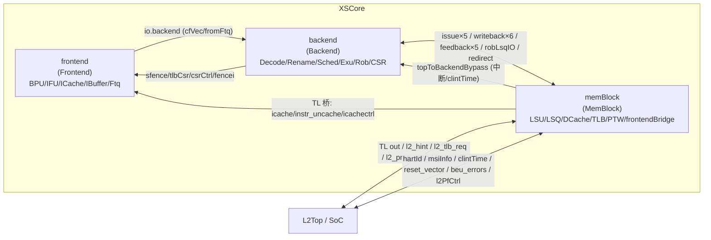

# XSCore —— 单核最高层总集成（capstone）

> 设计源：`src/main/scala/xiangshan/XSCore.scala`（`class XSCoreImp`）
> 可读核：`rtl/xscore/XSCore.sv`（`xs_XSCore_core`）+ `xscore_pkg.sv`
> 3 个子模块实例（3 种类型：Frontend / Backend / MemBlock）全部作 golden 黑盒（UT/FM 两侧共用）。
> 生成器：`scripts/gen_xscore.py`

XSCore 是香山单核的**最高层**。它本身**不重写任何功能块的内部逻辑**，只把已分别重写完成的
三大子系统——前端 Frontend、后端 Backend、访存 MemBlock——例化、互联起来。与 Backend 顶层
不同的是：**XSCore 连「顶层 glue」都几乎没有**——golden `XSCore.sv` 全文 `_T_` / `_GEN_` /
`inner_` 临时名 = **0**，没有任何打拍寄存器 / 计数器 / 状态机。所有跨模块边界的打拍都已经
下沉到各子模块内部（Backend 的 `*WbDelayed` / CSR 边界打拍、MemBlock 的边界打拍）。

可读核 = **3 处组合 glue（具名 wire / assign，本核里写出）** + **纯机械互联连线
（`xscore_inst.svh`）** + **顶层 io 输出驱动（`xscore_outassign.svh`）**。后两者由
`scripts/gen_xscore.py` 从 golden 端口表解析生成，套壳闸门 0。

---

## 1. 在 SoC 里的位置与子模块清单

| 实例名 | 类型 | 角色 | 黑盒来源 |
|--------|------|------|----------|
| `frontend` | `Frontend` | 分支预测 BPU / 取指 NewIFU / ICache 全族 / IBuffer / InstrUncache / Ftq；对外有 icache·instr_uncache 的 diplomacy TileLink **client** 节点 | 已重写（`docs/frontend/`） |
| `backend` | `Backend` | 译码 / 重命名 / 派遣 / 4 调度器 / DataPath / BypassNetwork / 3 ExuBlock / WbDataPath / Rob / NewCSR | 已重写（`docs/backend/`） |
| `memBlock` | `MemBlock` | LoadUnit / StoreUnit / LSQ 全族 / Sbuffer / DCache 全族 / TLB / PTW-L2TLB / **frontendBridge**（给前端的 TL 桥 + icachectrl 节点） | 已重写（`docs/memblock/`） |

> 三者都已各自从 Scala 设计意图重写完成、独立 UT+FM 验证过。在 XSCore 本层它们是
> **golden 黑盒**：UT 双例化两侧共用同一份 golden 子模块定义。

---

## 2. 互联结构（Scala 里全是 `<>` / `:=` 连线）

XSCore.scala 的全部连线意图，落在 `xscore_inst.svh`（4970 引脚连线）。可读核里只把 3 处真正
带「组合运算」的 glue 显式写出，其余引脚都是纯直连（io 端口 / `_frontend_*` / `_backend_*` /
`_memBlock_*` 互联网 / clock·reset / 常量）。

主要互联束（来自 `XSCore.scala`）：

- **前端 ↔ 后端**：`frontend.io.backend <> backend.io.frontend`（cfVec/fromFtq/toFtq），
  `sfence` / `tlbCsr` / `csrCtrl` / `fencei`（后端把 CSR/TLB 控制、栅栏、sfence 送前端）。
- **访存 → 后端**：`backend.io.fromTop := memBlock.io.mem_to_ooo.topToBackendBypass`
  （hartId/外部中断/clintTime/csr 边界经 memBlock 旁路进后端），
  `writeback×6`（Lda/Sta/HyuLda/HyuSta/Std/Vldu）、`feedback×5`（lda/sta/hyu/vstu/vldu IqFeedback）、
  `wakeup` / `ldCancel` / `stIssuePtr` / `sqDeq·lqDeq·DeqPtr·CancelCnt` / `robLsqIO` /
  `exceptionAddr`（vaddr/gpaddr/isForVSnonLeafPTE）/ `debugLS` / `lsTopdownInfo`。
  其中 **`stIn`** 是逐字段挑选映射（robIdx/ssid/storeSetHit，其余清 0）——在子模块边界完成，
  本层只是把 memBlock 的 stIn 束直连后端。
- **后端 → 访存**：`issue×5`（issueLda/Sta/Std/Hya/Vldu）、`storePc` / `hybridPc` / `flushSb` /
  `sfence` / `redirect` / `csrCtrl` / `tlbCsr` / `robLsqIO`（lcommit/scommit/pending*）/
  `isStoreException` / `isVlsException`。`issueHysta` 是 fake 端口（ready 恒 0）。
- **top ↔ memBlock**：`clintTime` / `msiInfo` / `hartId` / `l2_flush_done` / `reset_vector` /
  `perfEvents` / `l2_hint` / `l2_tlb_req` / `l2_pmp_resp` / `l2PfqBusy` / `traceCoreInterface` /
  `topDownInfo`（l2Miss/l3Miss）/ `dft` / `dft_reset`。**核级输出**（cpu_halt / l2_flush_en /
  power_down_en / cpu_critical_error / msiAck / resetInFrontend）都从 memBlock 直出。
- **diplomacy TileLink 桥**：`memBlock.frontendBridge.icache_node := frontend.icache.clientNode`，
  `instr_uncache_node := frontend.instrUncache.clientNode`，
  `frontend.icache.ctrlUnit.node := frontendBridge.icachectrl_node`。golden 里展开成
  `auto_inner_*` 扁平 TL 引脚（a/d 通道 ready/valid/bits），在 `xscore_inst.svh` 里直连。
- **复位链**（debugOpts.ResetGen）：`backend.reset := memBlock.io.reset_backend`，
  `frontend.reset := backend.io.frontendReset`（在子模块输出网上，本层直连）。

---

## 3. 顶层唯一的 3 处组合 glue

golden `XSCore.sv` 全文只有 **2 条 `assign`** + **1 处引脚内联 AND**，都是「BEU 总线错误聚合」
与「l2 预取 recv_en 直连」。这 3 处在可读核 `XSCore.sv` 里用具名 wire / assign 写出（不抽进
svh 套壳）：

| # | Scala 意图 | golden 形态 | 可读核写法 |
|---|-----------|------------|-----------|
| ① | `frontend.io.error.bits.toL1BusErrorUnitInfo(frontend.io.error.valid)` | memBlock 引脚 `io_inner_beu_errors_icache_ecc_error_valid (_frontend_io_error_valid & _frontend_io_error_bits_report_to_beu)` | `wire icacheBeuEccErrorValid = error_valid & report_to_beu;`，送 memBlock 引脚 |
| ② | `io.beu_errors.dcache <> memBlock.io.dcacheError.bits.toL1BusErrorUnitInfo(...)` | `assign io_beu_errors_dcache_ecc_error_valid = _memBlock_io_dcacheError_valid & _memBlock_io_dcacheError_bits_report_to_beu;` | `wire dcacheBeuEccErrorValid = valid & report_to_beu;`，`assign io_... = dcacheBeuEccErrorValid;` |
| ③ | `io.l2PfCtrl := backend...pf_ctrl.toL2PrefetchCtrl()`（recv_en 单走 assign） | `assign io_l2PfCtrl_l2_pf_recv_en = _backend_io_mem_csrCtrl_pf_ctrl_l2_pf_recv_enable;` | `assign io_l2PfCtrl_l2_pf_recv_en = ...;`（纯直连） |

`toL1BusErrorUnitInfo` 的语义：`ecc_error_valid = error.valid & report_to_beu`；其余字段（paddr
等）直接搬运。所以本层「真逻辑」只有这 2 个有效位的 AND。`l2PfCtrl` 的另外 3 路
（master_en / pbop_en / vbop_en）在 backend 例化引脚处直连。

---

## 4. 生成产物（`scripts/gen_xscore.py`）

| 产物 | 内容 |
|------|------|
| `rtl/xscore/xscore_ports.svh` | 可读核扁平端口表（285 功能端口，与 golden XSCore 同名，逐位宽逐方向一致） |
| `rtl/xscore/xscore_decls.svh` | 3 子模块黑盒输出/互联网声明（2342 个 `_frontend_/_backend_/_memBlock_*` wire，宽度从 golden 收割，missing=0） |
| `rtl/xscore/xscore_inst.svh` | 3 子模块黑盒例化 + 4970 引脚连核内具名信号/互联网（套壳闸门 0） |
| `rtl/xscore/xscore_outassign.svh` | 顶层 io 输出 2 条 assign（含 dcache BEU AND glue → 具名 wire） |
| `rtl/xscore/XSCore_wrapper.sv` | golden 同名扁平 wrapper（FM/ST 用，例化 `xs_XSCore_core`） |
| `rtl/xscore/xscore_blackbox_stubs.sv` | 3 子模块类型黑盒 stub（空体，输出 0；仅备快速 elaborate） |
| `verif/ut/XSCore/golden_filelist.f` | **golden 叶子传递闭包**：从 Frontend/Backend/MemBlock 递归收集 1433 模块 / 1405 文件，每文件一次 |
| `verif/ut/XSCore/{variants_xs.sv,tb.sv,Makefile}` | UT 双例化 testbench |

### 4.1 为什么 UT 用 `-f golden_filelist.f` 而非 `-y GOLDEN_RTL`

golden 叶子多为「自包含」文件：同一 `.sv` 内既定义 package 又定义 module（如 `DivUnit.sv`
内含 `package divunit_pkg` + `module DivUnit`）。VCS 的 `-y` 库解析会对这种文件「为提供
package」和「为提供 module」各拉一次，触发 `Error-[SV-PPD] Package previously declared`
（同文件同行重复声明）。

解法：`scripts/gen_xscore.py` 的 `golden_closure()` 从 3 个顶递归走 `^  <Type> <inst> (`
例化（大小写起首模块名都认，排除关键字），收集全部需要的 golden 文件，写进
`golden_filelist.f`，UT 用 `-f` **显式每文件编译一次**，VCS 自动按 package 依赖排序，彻底
规避重复声明。

---

## 5. 结构闸门（硬性）

| 闸门 | 实测 |
|------|------|
| 核 `XSCore.sv` + `xscore_pkg.sv`（去注释）`io_x_N_N / _REG_N / _GEN_ / _T_N / RANDOMIZE` | **0** |
| svh 套壳闸门 `_GEN_ / _T_[0-9]`（inst+decls+ports+outassign 合计） | **0** |
| 端口与 golden 逐行 diff（方向+位宽+名） | **完全一致**（285 功能端口） |
| inst 引脚数 vs golden | **4970 = 4970** |
| 互联网宽度收割 missing | **0 / 2342** |
| golden 临时名 leaks（inst / outassign） | **0 / 0** |

---

## 6. 验证

### 6.1 UT（双例化逐拍比对 golden 全部 129 个输出）

- 平台：`vcs ... +define+SYNTHESIS +vcs+initreg+0 -assert disable`，两侧共用同一份 golden
  子模块定义（`-f golden_filelist.f`，1405 文件 / 1433 模块），编译 0 错、`simv` 成功生成。
- testbench：`tb.sv` 例化 golden `XSCore` 与 `XSCore_xs`（→ `xs_XSCore_core`），negedge 随机驱
  156 个输入，比对 129 个输出（仅当 golden 输出非 X 才比，避开 flush-X / 未驱动）。

| seed | 拍数 | distinct_diverging_ports | errors | 结果 |
|------|------|--------------------------|--------|------|
| 1 | 120000 | 0 / 129 | 0 | TEST PASSED |
| 7 | 120000 | 0 / 129 | 0 | TEST PASSED |
| 42 | 120000 | 0 / 129 | 0 | TEST PASSED |

> 三种子各 120000 拍 bit-exact，129 个输出端口全部逐拍一致，`distinct_diverging_ports=0`。

### 6.2 FM（Formality 等价）

impl 侧（`XSCore_wrapper.sv` → `xs_XSCore_core`）与 ref 侧（golden `XSCore.sv`）只显式给到
3 个子模块顶（Frontend/Backend/MemBlock.sv），更深的 96 个叶子两侧都被 FM 黑盒化。

`make fm` 结果：**FAILED**——

| | 数量 |
|---|---|
| Passing（equivalent） | **645091** |
| Failing（not equivalent） | **20**（全部 BBPin，20 matched / 0 unmatched） |
| Aborted | 0 |
| Unverified | 10379 |

注意：failing=20 恰为 Formality 默认 `verification_failing_point_limit=20`，verify 在
**98%** 处触限提前中止，尚有 10379 个 compare point 未验证——下述「全在 memBlock 内部」
的论证只覆盖这前 20 个。

**前 20 个 failing 全部在 memBlock 子模块内部**（`u_core/memBlock/inner_xbar/*` 与
`inner_buffers*/auto_in_*` 的 TileLink crossbar/buffer data/param/ready/corrupt 引脚），
**XSCore 自身 top glue 在前 20 中 0 failing**（`grep -v u_core/(memBlock|backend|frontend)/` 为空）。

根因是 FM 工具局限（与 Backend.md 同类）：FM 把更深的 TL 叶子（xbar/buffer 内部）黑盒后，
其输出 pin 在 ref 扇入悬空（undriven），工具无法跨 ref/impl 配对 X 扇入——FM 自己也明示
*"20 failing compare points have unmatched undriven signals in their reference fan-in"*。
两侧共用同一份 golden 子模块,非设计差异。BEU glue（frontend `report_to_beu_reg` /
memBlock icache BEU 寄存器）均 matched 且 verified。

**结论口径：UT 三种子 120k bit-exact（129 输出端口逐拍 0 错）为权威；FM 为部分验证、未收敛。**

---

## 7. 下一轮入口

XSCore 是单核最高层，**其上还有 SoC 顶层**（`XSTile` / `XSTop` / L2Top / CHI 桥），把多核 +
L2/L3 + CLINT/PLIC/IMSIC + 总线互联组装。若继续向上：套路相同（顶层 = 子模块黑盒例化 +
互联 + 少量 glue），可复用 `gen_xscore.py` 的闭包式 `-f` filelist 机制。
