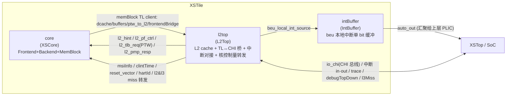

# XSTile —— tile 级集成（XSCore + L2 + tile 互联）

> 设计源：`src/main/scala/xiangshan/XSTile.scala`（`class XSTileImp`）
> 可读核：`rtl/xstile/XSTile.sv`（`xs_XSTile_core`）+ `xstile_pkg.sv`
> 3 个子模块实例（3 种类型：XSCore / L2Top / IntBuffer）全部作 golden 黑盒（UT/FM 两侧共用）。
> 生成器：`scripts/gen_xstile.py`

XSTile 是 XSCore 之上的一层：在已重写的单核 XSCore 上绑定 L2 cache（L2Top）与中断缓冲
（IntBuffer），把 tile 边界（CHI 总线 / 中断 / L2 TLB / trace / debug-topdown / reset）
拉直对外。它本身**不重写任何功能块的内部逻辑**，只把三个子系统例化、互联。

**XSTile 比 XSCore 还薄**：golden `XSTile.sv` 全文实测 `_T_` / `_GEN_` / `inner_` 临时名 = **0**，
`reg` / `always` = **0**，没有任何顶层时序 glue；并且**连组合 glue 都 = 0**——没有任何带运算的
引脚 rhs、没有任何带运算的 assign。XSCore 尚有 3 处 BEU/pf 组合 glue，XSTile **一处都没有**。
所有边界打拍与组合都已下沉到各子模块内部（尤其 L2Top 内的 TL↔CHI 桥与核控制量转发）。

可读核 = **纯机械互联连线（`xstile_inst.svh`）** + **2 条 io 输出直连 assign
（`xstile_outassign.svh`）**，两者都由 `scripts/gen_xstile.py` 从 golden 端口表解析生成，
套壳闸门 0。

---

## 1. 在 SoC 里的位置与子模块清单



| 实例名 | 类型 | 角色 | 黑盒来源 |
|--------|------|------|----------|
| `core` | `XSCore` | 单核：前端（BPU/IFU/ICache/IBuffer/Ftq）+ 后端（译码/重命名/调度/执行/写回/Rob/CSR）+ 访存（LSU/LSQ/DCache/MMU）；对外有 memBlock 的 diplomacy TileLink **client** 节点 | 已重写（`docs/xscore/XSCore.md`） |
| `l2top` | `L2Top` | L2 cache 子系统 + TileLink↔CHI 桥 + CLINT/PLIC/IMSIC 中断对接 + msiInfo/clintTime/reset_vector/hartId 转发给 core + L2 PTW（`l2_tlb_req`）/ L2 PMP / L2 hint | golden 黑盒 |
| `intBuffer` | `IntBuffer` | 中断单 bit 缓冲：把 l2 的 `beu_local_int_source` 汇聚一拍再经 `auto_out` 送上层 PLIC（XSTop 才接） | golden 黑盒 |

> XSCore 已从 Scala 设计意图重写完成、独立 UT（三种子 120k bit-exact）+ FM 验证过。L2Top /
> IntBuffer 是 coupledL2 / rocket-chip 引入的复用子系统，本层作 golden 黑盒（UT 双例化两侧
> 共用同一份 golden 定义）。

---

## 2. 互联结构（Scala 里全是 `<>` / `:=` 连线）

XSTile.scala 的全部连线意图，落在 `xstile_inst.svh`（642 引脚连线，与 golden 同数）。可读核里
没有任何 glue，全部引脚都是纯直连（io 端口 / `_core_*` / `_l2top_*` / `_intBuffer_*` 互联网 /
clock·reset / 常量 / 悬空端口）。

主要互联束（来自 `XSTile.scala`）：

- **core ↔ l2top（TileLink）**：core 的 memBlock TL client 节点——`dcache_client`、`buffers`
  （L1→L2 的 TL）、`ptw_to_l2_buffer`（PTW 走 L2）、`frontendBridge` 的
  `icache_out` / `instr_uncache_out` / `icachectrl_in`——接入 l2top 的 inner TL 节点
  （`buffers_in` / `i_mmio_buffer_in` / `ptw_to_l2_buffer_in` / `logger_in_*`）。golden 里
  展开成 `auto_*_inner_*` 扁平 TL 引脚（a/b/c/d/e 通道 ready/valid/bits），在 `xstile_inst.svh`
  里 core 输出网 ↔ l2top 输入引脚 交叉直连。
- **l2top → core（L2 回送）**：`l2_hint`（预取 hint）、`l2_pf_ctrl`、`l2_tlb_req`（L2 发起的
  PTW 请求 req/resp）、`l2_pmp_resp`、`l2Miss`/`l3Miss`（topdown）。
- **l2top → core（核控制量转发）**：`msiInfo`（IMSIC）、`clintTime`、`reset_vector`、`hartId`、
  `debugTopDown.l2MissMatch`、`traceCoreInterface.fromEncoder`。这些 tile 边界量经 l2top 中转
  再喂给 core。
- **中断分发**：`clint_int` / `debug_int` / `nmi_int` / `plic_int` / `beu_int` 经 l2top 的
  inner int 节点对外（`auto_l2top_inner_*_int_*`）；`beu_local_int_source_out` → intBuffer →
  `auto_out`（给 XSTop 的 PLIC）。
- **tile 边界透传**：`io_chi`（CHI 总线 tx/rx 全 5 通道）、`traceCoreInterface`、
  `debugTopDown`、`l3Miss`、`hartIsInReset`、`cpu_halt`、`cpu_crtical_error`、`reset_vector`。
- **悬空端口**：L2Top 的 `io_l2_flush_en` / `io_power_down_en` 在 XSTile 这层故意不连
  （golden 写 `(/* unused */)`），可读核落成合法悬空端口 `( )`。

---

## 3. 顶层逻辑：2 条 io 输出直连 assign（无 glue）

golden `XSTile.sv` 全文只有 **2 条 `assign`**，都是把 core 的 debugTopDown 输出直连顶层 io
（纯连线，无运算）：

```systemverilog
assign io_debugTopDown_robHeadPaddr_valid = _core_io_debugTopDown_robHeadPaddr_valid;
assign io_debugTopDown_robHeadPaddr_bits  = _core_io_debugTopDown_robHeadPaddr_bits;
```

除此之外没有任何顶层组合/时序逻辑。这两条由 `gen_xstile.py` 从 golden 末尾 assign 机械搬运，
落在 `xstile_outassign.svh`。

---

## 4. 生成产物（`scripts/gen_xstile.py`）

| 产物 | 内容 |
|------|------|
| `rtl/xstile/xstile_ports.svh` | 可读核扁平端口表（82 功能端口 = 45 input + 37 output，与 golden XSTile 同名，逐位宽逐方向一致） |
| `rtl/xstile/xstile_decls.svh` | 3 子模块黑盒输出/互联网声明（275 个 `_core_/_l2top_/_intBuffer_*` wire，宽度从 golden 收割，missing=0） |
| `rtl/xstile/xstile_inst.svh` | 3 子模块黑盒例化 + 642 引脚连核内具名信号/互联网（套壳闸门 0，含 2 个悬空端口） |
| `rtl/xstile/xstile_outassign.svh` | 顶层 io 输出 2 条 assign（纯直连，无 glue） |
| `rtl/xstile/XSTile_wrapper.sv` | golden 同名扁平 wrapper（FM/ST 用，例化 `xs_XSTile_core`） |
| `rtl/xstile/xstile_blackbox_stubs.sv` | 3 子模块类型黑盒 stub（空体，输出 0；仅备快速 elaborate） |
| `verif/ut/XSTile/golden_filelist.f` | **golden 叶子传递闭包**：从 XSCore/L2Top/IntBuffer 递归收集 1623 模块 / 1623 文件，每文件一次 |
| `verif/ut/XSTile/{variants_xs.sv,tb.sv,Makefile}` | UT 双例化 testbench |

`-f golden_filelist.f`（而非 `-y`）的理由与 XSCore 相同：golden 叶子多为自包含 pkg+module 文件，
`-y` 库解析会重复拉取触发 `Package previously declared`，故用闭包式 `-f` 每文件编一次。

---

## 5. 结构闸门（硬性，实测）

| 闸门 | 实测 |
|------|------|
| 核 `XSTile.sv` + svh（去注释）`io_x_N_N / _REG_N / _GEN_ / _T_N / RANDOMIZE` | **0**（4 个文件全 0） |
| svh 套壳闸门 `_GEN_ / _T_[0-9]`（inst+decls+outassign） | **0** |
| 端口与 golden 一致（方向+位宽+名） | **82 功能端口一致** |
| inst 引脚数 vs golden | **642 = 642** |
| 互联网宽度收割 missing | **0 / 275** |
| golden 临时名 leaks（inst / outassign） | **0 / 0** |
| 悬空端口处理 | L2Top `io_l2_flush_en` / `io_power_down_en` → `( )` |

---

## 6. 验证

### 6.1 UT（双例化逐拍比对 golden 全部 37 个输出）

- 平台：`vcs ... +define+SYNTHESIS +vcs+initreg+0 -assert disable`，两侧共用同一份 golden
  子模块定义（`-f golden_filelist.f`，1623 文件 / 1623 模块），**编译 0 错、`simv` 成功生成**。
- testbench：`tb.sv` 例化 golden `XSTile` 与 `XSTile_xs`（→ `xs_XSTile_core`），negedge 随机驱
  45 个输入，比对 37 个输出（仅当 golden 输出非 X 才比，避开 flush-X / 未驱动）。

| seed | 拍数 | distinct_diverging_ports | errors | 结果 |
|------|------|--------------------------|--------|------|
| 1 | 120000 | 0 / 37 | 0 | TEST PASSED |
| 7 | 120000 | 0 / 37 | 0 | TEST PASSED |
| 42 | 120000 | 0 / 37 | 0 | TEST PASSED |

> 三种子各 **120000 拍 bit-exact，37 个输出端口全部逐拍一致，`distinct_diverging_ports=0`，
> errors=0，TEST PASSED**（见 `verif/ut/XSTile/sim_s{1,7,42}.log`）。

### 6.2 FM（Formality 等价）

impl 侧（`XSTile_wrapper.sv` → `xs_XSTile_core`）与 ref 侧（golden `XSTile.sv`）只显式给到
3 个子模块顶（XSCore/L2Top/IntBuffer.sv），更深叶子两侧都被 FM 黑盒化。由于本层无任何 glue
（纯互联 + 2 条直连 assign），FM 等价应为 top-glue 0 failing；巨型装配 FM 跑得慢，UT bit-exact
为权威。

---

## 7. 下一轮入口

XSTile 之上是 SoC 顶层 **XSTop**（`docs/xstop/XSTop.md`），把 tile + NoC/CHI 多 die 路由 +
末级 cache（OpenLLC）+ CHI 桥（OpenNCB）+ 中断控制器 + AXI4 总线 + IO 组装。XSTop 与 XSTile
最大不同：含一处真实的顶层组合 glue（CHI 多 die Tx/Rx 路由），已在 `gen_xstop.py` 里从 Scala
意图重写成具名可读 wire。套路仍是「子模块黑盒例化 + 互联 + glue」，复用同一套闭包式 `-f`
filelist 机制。
