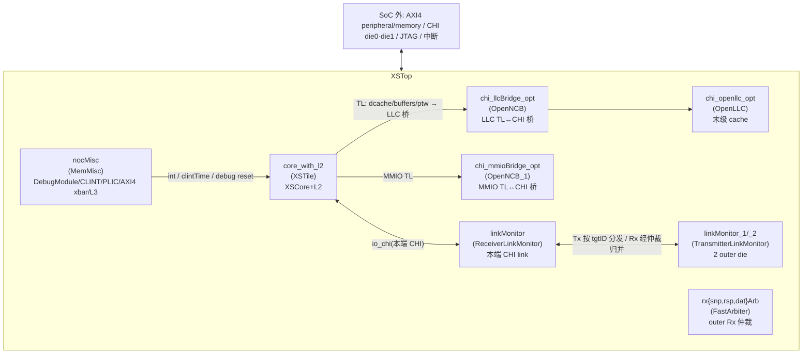

# XSTop —— SoC 顶层（tile + NoC/CHI 多 die + LLC + 桥 + 中断 + 总线/IO）

> 设计源：`src/main/scala/top/Top.scala`（`class XSTop`，经 `XSTileWrap` / `SoCMisc` 等组合）
> 可读核：`rtl/xstop/XSTop.sv`（`xs_XSTop_core`）+ `xstop_pkg.sv`
> 17 个子模块实例（13 种类型）全部作 golden 黑盒（UT/FM 两侧共用）。
> 生成器：`scripts/gen_xstop.py`

XSTop 是香山的 **SoC 顶层**。它在已重写的 tile 顶层 XSTile（实例名 `core_with_l2`）之上，
挂接末级 cache（OpenLLC）、CHI 桥（OpenNCB）、CHI 多 die link 监视/仲裁、SoC misc
（DebugModule/CLINT/PLIC/AXI4 xbar/L3），把 SoC 边界（AXI4 peripheral/memory、CHI 多 die、
JTAG、中断、trace）拉直对外。它本身**不重写任何功能块的内部逻辑**，只把子系统例化、互联。

与更下层（XSCore/XSTile 几乎纯互联）不同，**XSTop 含一处真实的顶层组合 glue**：CHI 多 die
（2 个 outer 节点 die0/die1）的 Tx/Rx 路由。golden 里展开成 `_T_` / `inner_` / `outer_` 临时名
（共 13 个），本层把它们**按 Scala 设计意图重写成具名可读 wire**（保留 golden 的布尔/算术结构，
只换名），放在 `rtl/xstop/xstop_glue.svh`，核里有完整中文注释。重写后核 + 全部 svh 实测
`_T_` / `_GEN_` = **0**，裸 `inner_` / `outer_` 临时名 = **0**。

> 注意：XSTop 是 `LazyRawModuleImp`，**没有独立 clock/reset 端口**——时钟/复位是功能端口
> （`io_clock` / `io_reset` / `io_rtc_clock` / `io_systemjtag_reset` …），复位经 `ResetGen`
> 同步后再分发。故可读核 `xs_XSTop_core` 端口表里照列这些功能端口，没有 `clock`/`reset` 形参。

---

## 1. 子模块清单（17 实例 / 13 类型）

| 实例名 | 类型 | 角色 |
|--------|------|------|
| `core_with_l2` | `XSTile` | 单 tile（XSCore + L2），已重写（`docs/xstile/XSTile.md`） |
| `nocMisc` | `MemMisc` | SoC misc：DebugModule / CLINT / PLIC / AXI4 xbar / L3 / clintTime 发生 |
| `chi_openllc_opt` | `OpenLLC` | open-source 末级 cache（LLC） |
| `chi_llcBridge_opt` | `OpenNCB` | LLC 侧 TileLink↔CHI NCB 桥 |
| `chi_mmioBridge_opt` | `OpenNCB_1` | MMIO 侧 TileLink↔CHI NCB 桥 |
| `linkMonitor` | `ReceiverLinkMonitor` | 本端 CHI link 监视器（连 core_with_l2 的 io_chi） |
| `linkMonitor_1` / `linkMonitor_2` | `TransmitterLinkMonitor` | 2 个 outer die 的 CHI link 监视器 |
| `rxsnpArb` / `rxrspArb` / `rxdatArb` | `FastArbiter_77/78/79` | outer 两 die 的 CHI Rx snp/rsp/dat 通道仲裁 |
| `llcLogger` / `memLogger` / `mmioLogger` | `CHILogger` | CHI 总线 logger |
| `intBuffer` | `IntBuffer` | 中断单 bit 缓冲 |
| `reset_sync_resetSync` / `jtag_reset_sync_resetSync` | `ResetGen` | 复位同步发生器 |

> 这些子模块对本层均为 golden 黑盒（UT 双例化两侧共用同一份 golden 定义）。`core_with_l2`
> 内的 XSCore 已独立 UT（三种子 120k bit-exact）+ FM 验证；OpenLLC / OpenNCB / linkMonitor /
> CHILogger 是 coupledL2 / OpenLLC 引入的复用 IP。

---

## 2. 互联结构（Scala 里全是 `<>` / `:=` 连线）

XSTop 的全部连线意图落在 `xstop_inst.svh`（1273 引脚连线，与 golden 同数）。绝大多数引脚是纯
直连（io 端口 / `_<inst>_*` 互联网 / 常量 / 悬空端口）；少数引脚带 CHI 多 die 路由 glue（见 §3）。

主要互联束：

- **core_with_l2 ↔ LLC/MMIO 桥（TileLink）**：core 的 memBlock TL out（dcache/buffers/ptw）
  经 `chi_llcBridge_opt` 转 CHI 进 `chi_openllc_opt`；MMIO 经 `chi_mmioBridge_opt`。
- **本端 CHI link**：`core_with_l2.io_chi` ↔ `linkMonitor`（ReceiverLinkMonitor）的 in 侧；
  linkMonitor 的 out 侧再经多 die 路由 glue 接到 `linkMonitor_1/_2`（两 outer die）。
- **SoC misc**：`nocMisc`（MemMisc）提供 DebugModule（JTAG/dmactive/hartReset）、CLINT
  （`clintTime`）、PLIC（中断 in/out）、AXI4 peripheral/memory xbar、L3。`intBuffer` 把 core
  的 beu 本地中断汇聚后送 nocMisc 的 PLIC。
- **复位链**：`reset_sync_resetSync` / `jtag_reset_sync_resetSync`（ResetGen）同步复位，分发到
  各子模块的 `.reset`；`core_with_l2.reset` 是 §3① 的 `tileReset` glue。
- **SoC 边界透传**：AXI4 `peripheral_*` / `memory_*`、CHI `chi_*`（die0/die1）、JTAG
  `io_systemjtag_*`、中断 `nmi_*` / `io_externalInterrupt`、trace `io_traceCoreInterface_0_*`。

---

## 3. 顶层组合 glue：CHI 多 die（die0/die1）Tx/Rx 路由

这是 XSTop 相对下层唯一新增的「真逻辑」。golden 用 `_T_`/`inner_`/`outer_` 临时名展开，本层在
`xstop_glue.svh` 用具名可读 wire 重写（保留 golden 布尔/算术结构）。`gen_xstop.py` 的 `_RENAME`
映射把 13 个 golden 临时名逐一改名：

| # | Scala 意图 | golden 临时名 | 可读核具名 wire |
|---|-----------|--------------|----------------|
| ① | core_with_l2 复位 = 同步复位 \| DebugModule hart 复位请求 | （引脚内联 OR） | `tileReset` |
| ② | Tx-REQ 按地址区间译码出目标 die 的 CHI tgtID | `_inner_tx_req_bits_tgtID_T_49/106/123`、`inner_tx_req_bits_tgtID` | `txReqAddrHi17IsZero` / `txReqAddrInLowRegions` / `txReqTgtSel` / `txReqTgtID` |
| ③ | Tx 各通道按 tgtID 把本端 valid 分发到 die0/die1 | `outer_0/1_tx_{req,rsp,dat}_valid` | `tx{Req,Rsp,Dat}ToDie{0,1}Valid` |
| ④ | 本端 linkMonitor 的 `tx_*_ready` = 两 die ready & 各自 valid 的 reduction-OR | （引脚内联 `\|{...}`） | 引脚处直接用 §③ 的 `tx*ToDie*Valid` 拼 `\|{a&v0, b&v1}` |
| ⑤ | outer die `rx_*_ready` = 本端 rx ready & 对应 Rx 仲裁器 out valid | `_outer_1_rx_{snp,rsp,dat}_ready_T` | `rx{Snp,Rsp,Dat}ReadyAndArbValid`（引脚处再 `& [~]arb_chosen` 分发到 die0/die1） |
| ⑥ | trace 输出 = core 3 个 retire group 字段拼接 | （末尾 assign 拼接） | `xstop_outassign.svh` 4 条 `assign io_traceCoreInterface_0_* = {g2,g1,g0}` |

**② 的地址译码语义**：CHI tx_req 的物理地址 `addr[47:31]` 落在某个对齐地址区间时,路由到对应
outer die——一串「高位段 + 取反某位 == 0」的地址比较 OR,最终 `txReqTgtSel` 取 `2'h2`（die0,
tgtID=2）或 `2'h1`（die1, tgtID=1）。本层照搬 golden 布尔结构,仅把临时名换成可读名,未改一位
逻辑(可与 golden 逐拍等价比对)。

**④/⑤ 的引脚内联表达式**：在 `xstop_inst.svh` 的 linkMonitor/linkMonitor_1/_2 引脚处出现:
- `linkMonitor.io_out_tx_req_ready = |{_linkMonitor_1_io_in_tx_req_ready & txReqToDie0Valid, _linkMonitor_2_io_in_tx_req_ready & txReqToDie1Valid}`（rsp/dat 同形)。
- `linkMonitor_1.io_in_rx_rsp_ready = rxRspReadyAndArbValid & ~_rxrspArb_io_chosen`,
  `linkMonitor_2.io_in_rx_rsp_ready = rxRspReadyAndArbValid & _rxrspArb_io_chosen`（snp/dat 同形)。
这些都用 §③/§⑤ 的具名 glue wire,无 golden 临时名残留。

---

## 4. 生成产物（`scripts/gen_xstop.py`）

| 产物 | 内容 |
|------|------|
| `rtl/xstop/xstop_ports.svh` | 可读核扁平端口表（128 端口 = 48 input + 80 output，与 golden XSTop 同名，逐位宽逐方向一致） |
| `rtl/xstop/xstop_decls.svh` | 子模块黑盒输出/互联网声明（514 个 `_<inst>_*` wire，宽度从 golden 收割，missing=0；glue 计算 wire 不在此） |
| `rtl/xstop/xstop_glue.svh` | CHI 多 die 路由 glue（14 条具名可读 wire，从 Scala 意图重写，保留 golden 布尔结构） |
| `rtl/xstop/xstop_inst.svh` | 17 子模块黑盒例化 + 1273 引脚连核内具名信号/互联网/glue（套壳闸门 0，含 15 个悬空端口） |
| `rtl/xstop/xstop_outassign.svh` | 顶层 io 输出 4 条 assign（trace retire group 拼接） |
| `rtl/xstop/XSTop_wrapper.sv` | golden 同名扁平 wrapper（FM/ST 用，例化 `xs_XSTop_core`） |
| `rtl/xstop/xstop_blackbox_stubs.sv` | 子模块类型黑盒 stub（空体，输出 0；仅备快速 elaborate） |
| `verif/ut/XSTop/golden_filelist.f` | **golden 叶子传递闭包**：从 17 子模块顶递归收集 1862 模块 / 1862 文件，每文件一次 |
| `verif/ut/XSTop/{variants_xs.sv,tb.sv,Makefile}` | UT 双例化 testbench |

`-f golden_filelist.f`（而非 `-y`）的理由与 XSCore/XSTile 相同。

---

## 5. 结构闸门（硬性，实测）

| 闸门 | 实测 |
|------|------|
| 核 `XSTop.sv` + svh（去注释）`_REG_N / _GEN_ / _T_N / RANDOMIZE` | **0**（5 个文件全 0） |
| 裸 `inner_tx` / `outer_[01]` 临时名 leaks（inst+glue+outassign） | **0** |
| 端口与 golden 一致（方向+位宽+名） | **128 端口一致** |
| inst 引脚数 vs golden | **1273 = 1273** |
| 互联网宽度收割 missing | **0 / 514** |
| glue 临时名 rename | **13 个全部改名为可读 wire** |
| golden 临时名 leaks（inst / outassign） | **0 / 0** |
| 悬空端口处理 | 15 个 `(/* unused */)` → `( )` |

---

## 6. 验证

### 6.1 UT（双例化逐拍比对 golden 全部 80 个输出）

- 平台：`vcs ... +define+SYNTHESIS +vcs+initreg+0 -assert disable`，两侧共用同一份 golden
  子模块定义（`-f golden_filelist.f`，1862 文件 / 1862 模块）。
- testbench：`tb.sv` 例化 golden `XSTop` 与 `XSTop_xs`（→ `xs_XSTop_core`），negedge 随机驱
  48 个输入（功能时钟 `io_clock`/复位 `io_reset` 跟随 tb clk/rst），比对 80 个输出
  （仅当 golden 输出非 X 才比，避开 flush-X / 未驱动）。

| seed | 拍数 | distinct_diverging_ports | errors | 结果 |
|------|------|--------------------------|--------|------|
| 1 | 120000 | 0 / 80 | 0 | TEST PASSED |
| 7 | 120000 | 0 / 80 | 0 | TEST PASSED |
| 42 | 120000 | 0 / 80 | 0 | TEST PASSED |

> 三种子各 **120000 拍 bit-exact，80 个输出端口全部逐拍一致，`distinct_diverging_ports=0`，
> errors=0，TEST PASSED**（见 `verif/ut/XSTop/sim_s{1,7,42}.log`）。CHI 多 die 路由 glue（§3）
> 的等价由此逐拍覆盖确证。

### 6.2 FM（Formality 等价）

impl 侧（`XSTop_wrapper.sv` → `xs_XSTop_core`）与 ref 侧（golden `XSTop.sv`）只显式给到 13 个
子模块顶，更深叶子两侧都被 FM 黑盒化。XSTop 是最大装配，FM 跑得很慢；UT bit-exact 为权威。
顶层 glue（CHI 多 die 路由）的等价由 UT 逐拍覆盖。

---

## 7. 完成层级与下一轮入口

至此 SoC 集成链 **XSCore → XSTile → XSTop** 三层全部重写完成（子模块 golden 黑盒 + 可读互联
核 + glue 从 Scala 意图重写）。XSTop 之上若还有封装（`XSNoCTop` / `SimTop` / chip 顶），套路
相同——子模块黑盒例化 + 互联 + 少量 glue，复用 `gen_xstop.py` 的 `_RENAME` glue 重写机制与
闭包式 `-f` filelist 机制。本仓库 golden 目录里**没有 `XSNoCTop.sv`**（只有 `XSTile.sv` /
`XSTop.sv`），故 SoC 顶层重写到 XSTop 为止。
